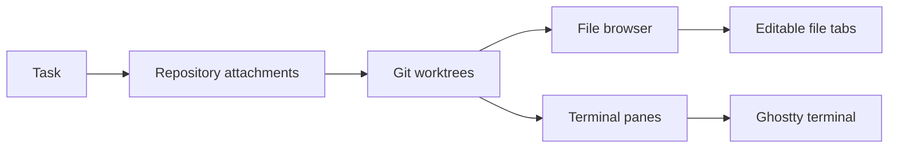

# Piñata documentation

Piñata is a native macOS workspace for coding tasks. A task can stay a note, or grow into one or more isolated Git worktrees and terminal sessions.

## Read this first

| Document | Use it for | Status |
| --- | --- | --- |
| [Product and workflow](product-and-workflow.md) | User concepts, task lifecycle, worktree creation, cleanup, and failure recovery. | Implemented |
| [Application map](application-map.md) | Current screens, navigation, and local versus SSH repository paths. | Implemented |
| [Application architecture](application-architecture.md) | AppKit components, ownership, persistence, concurrency, and data schemas. | Implemented |
| [Terminal session architecture](terminal-session-architecture.md) | Ghostty, PTY services, session restoration, and recovery limits. | Implemented |
| [File browser architecture](file-browser-architecture.md) | Right-panel ownership, local and SSH loading, file opening, caching, refresh, and performance constraints. | Implemented |
| [SSH connections](ssh-connections.md) | Remote repositories, worktrees, and durable SSH terminals. | Implemented |
| [Pi Harness architecture](incoming/pi-harness-architecture.md) | Future Pi and remote execution proposal. | Incoming, not implemented |

## Product boundary

Piñata manages local and SSH-backed repositories, worktrees, file browsing, and terminals. GitHub workflows, diffs, reviews, Pi discussions, and remote process recovery are not available yet.

## How to use these documents

1. Start with [Product and workflow](product-and-workflow.md) to understand what users see.
2. Use [Application map](application-map.md) to find the screen and workflow you are changing.
3. Read [Application architecture](application-architecture.md) before changing persisted data, task behavior, or UI ownership.
4. Read [Terminal session architecture](terminal-session-architecture.md) before changing terminal startup, reconnect, or cleanup.
5. Read [File browser architecture](file-browser-architecture.md) before changing the right panel, file-tree cache, or refresh behavior.
6. Read [SSH connections](ssh-connections.md) before changing remote repositories or terminal targets.
7. Treat everything under [`incoming/`](incoming/) as a proposal, not current behavior.
