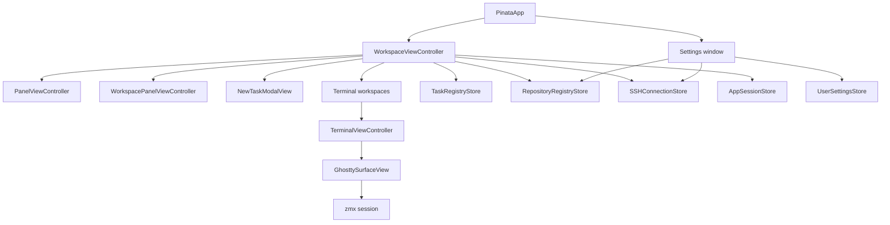
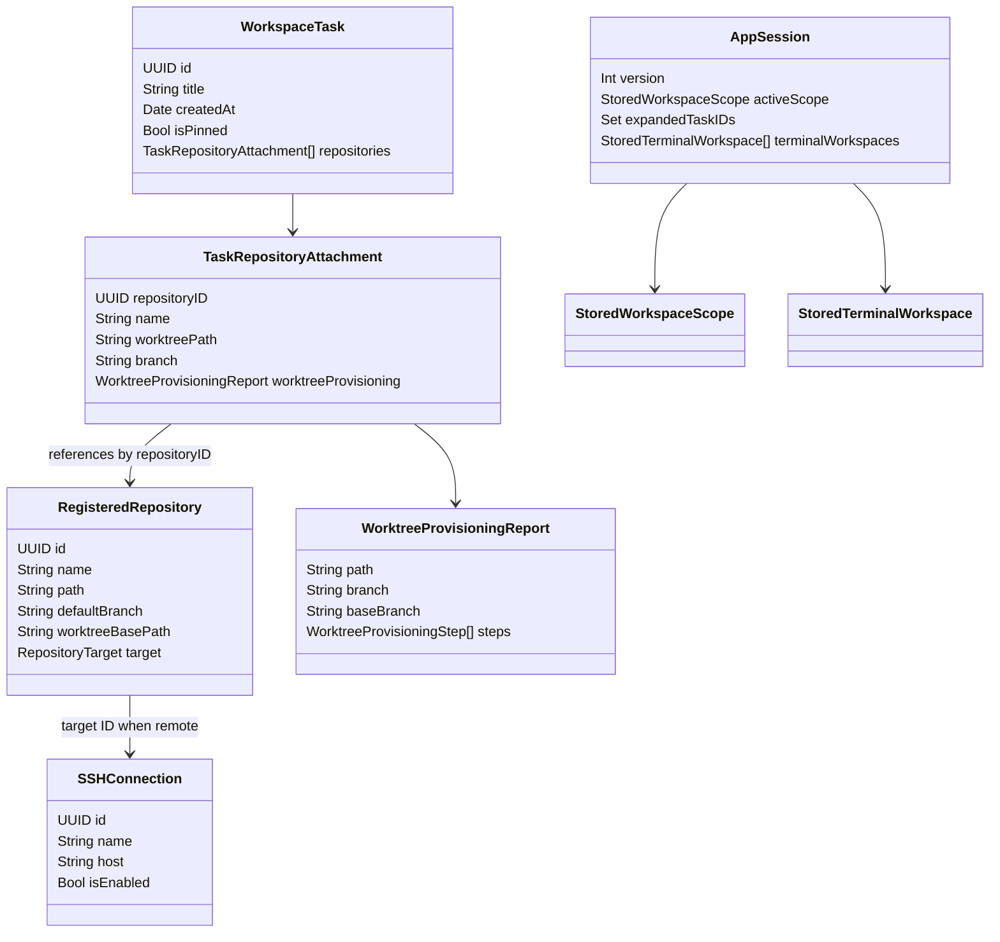
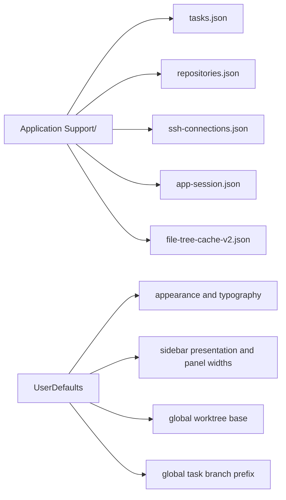
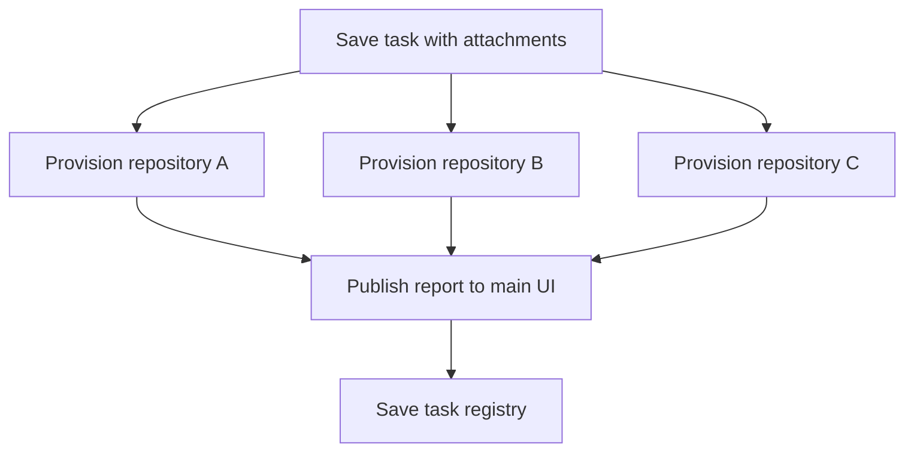
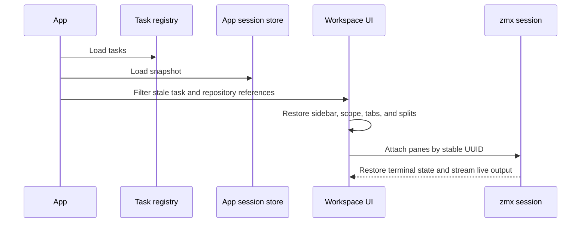

# Application architecture

## Runtime shape

Piñata is a Swift 6 AppKit application for macOS 14 or later. AppKit owns the window, menu bar, panels, focus, native controls, and application lifecycle. Ghostty owns terminal emulation and rendering.

## Ownership rules

| Owner | Owns | Does not own |
| --- | --- | --- |
| `PinataApp` | App lifecycle, menu installation, root workspace. | Task persistence or terminal pane layout. |
| `WorkspaceViewController` | Selected scope, task actions, provisioning coordination, terminal workspaces, ephemeral file tabs, and app-session persistence. | Ghostty rendering or PTY I/O. |
| `PanelViewController` | Left task sidebar presentation and user gestures. | Right workspace-panel layout or file browsing. |
| `WorkspacePanelViewController` | Right panel tabs, file-tree loading, caching, and refresh. | Left sidebar presentation or registry data source of truth. |
| `TerminalViewController` | Terminal tab's split tree, panes, active pane, and pane actions. | Durable PTY process. |
| `GhosttySurfaceView` | Terminal rendering, keyboard encoding, terminal scrolling. | Shell process or output history. |
| `ZmxTerminalClient` | Attaches one pane to its named zmx session. | AppKit views, layout, or terminal persistence. |
| Registry stores | Codable local data. | UI state or long-lived process state. |

The central rule is simple: UI controllers project persisted task data and live terminal data, but do not become the durable owner of shell processes.

## Data model

`TaskRepositoryAttachment` intentionally stores the attachment name, worktree path, branch, and latest provisioning report. This lets the sidebar and failure state remain understandable even while repository inspection is unavailable or a worktree operation fails.

## File editor

`WorkspaceViewController` owns ephemeral file tabs for the active task or repository workspace. Each tab stores its path, editor controller, and preview state. A single click reuses the current preview tab when previews are enabled, while a double click promotes the file to a permanent tab. The tab title shows `*` while the editor has unsaved changes.

`FileEditorStore` reads and writes local files directly and uses the registered SSH target for remote files. Reads and writes run away from the main actor. The editor accepts UTF-8 text files up to 4 MB, shows a loading state while reading, and saves with `Cmd+S`.

`SyntaxHighlighter` detects the language from the file name and applies the Pinata palette. It supports common programming and configuration formats plus Markdown headings, emphasis, links, fenced code, and inline code. File tabs and unsaved editor contents are not part of the terminal session snapshot.

## Local persistence

All persisted data is local to the macOS user account.

| Data | Store | Written when |
| --- | --- | --- |
| Tasks, attachment order, pins, worktree metadata | `tasks.json` | Task create, edit, reorder, provision, detach, delete. |
| Registered repositories and overrides | `repositories.json` | Repository registration or settings edit. |
| SSH connection names, aliases, and enabled state | `ssh-connections.json` | Connection edit or enable change. |
| UI and terminal layout snapshot | `app-session.json` | Relevant workspace change, with a short coalescing delay, and app termination. |
| File-tree listings and expanded paths | `file-tree-cache-v2.json` | Workspace change, right-panel close, and app termination. |
| Appearance and small UI preferences | `UserDefaults` | Settings or panel presentation change, including editor font size, file preview behavior, worktree base, and task branch prefix. |

JSON writes use atomic replacement. Session files use a version number. An unsupported version is ignored rather than decoded as a partially compatible layout.

## Worktree concurrency

The app persists the task before starting Git work. It then starts independent provisioning operations for each new attachment. Each operation sends report updates back to the main UI, where the task registry is updated and rendered.

This design means one failed repository does not make the others fail or wait. The task's state is the composition of its attachment states.

## Session restoration

At startup, the workspace loads tasks first, then loads the optional session snapshot. It discards snapshot references to tasks or attachments that no longer exist, restores the valid expanded state and selected scope, then recreates terminal workspaces and split panes.

The snapshot preserves UI topology, not process memory. See [Terminal session architecture](terminal-session-architecture.md) for the recovery contract.

## Main-thread and background work

- AppKit views and user interaction stay on the main actor.
- Git provisioning runs away from the UI, while each report update returns to the main UI before mutation.
- Remote Git provisioning uses the registered OpenSSH alias with non-interactive authentication. SSH credentials remain outside Piñata.
- Local file changes use one recursive, coalesced FSEvents stream while the Files panel is visible.
- SSH file changes use foreground-only signature polling and only relist changed visible directories.
- File-tree enumeration, prefetch, and cache writes run away from scrolling and remain bounded.
- zmx owns durable PTYs outside the application process. Piñata only bridges its attached client to Ghostty.
- Registry and session stores are synchronous local file operations invoked at clear state boundaries.

## Error handling

Piñata keeps error state with the resource that failed:

| Failure | User-visible result | Recovery |
| --- | --- | --- |
| Fetch, branch, or worktree failure | Failed repository attachment with concise error. | Retry provisioning. |
| Detach or task cleanup failure | Deleting or failed state remains visible. | Retry cleanup. |
| Missing zmx session | zmx creates a fresh named shell session. | Start a new shell. |
| SSH terminal connection | The pane stays open with the SSH failure and a disconnected header. | Reconnect. |
| Local or SSH folder load | The affected folder shows an error and retry action. | Retry the folder load. |
| Invalid session snapshot | Ignore unsupported or stale entries. | Restore the remaining valid UI. |

The app does not treat a failed attachment as a failed task. It only marks the affected attachment as failed.

## Architecture boundaries

Do not put the following in current production code until the feature exists:

- Pi worker management or agent transcript storage.
- GitHub API workflows.
- A replacement terminal renderer or custom terminal scrollback.

Those proposed future capabilities live under [`docs/incoming/`](incoming/). Keeping them separate prevents current local behavior from depending on future infrastructure.

See [File browser architecture](file-browser-architecture.md) for the file-tree ownership and performance contract.
