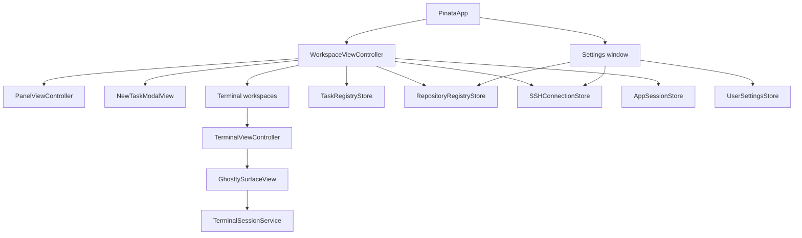
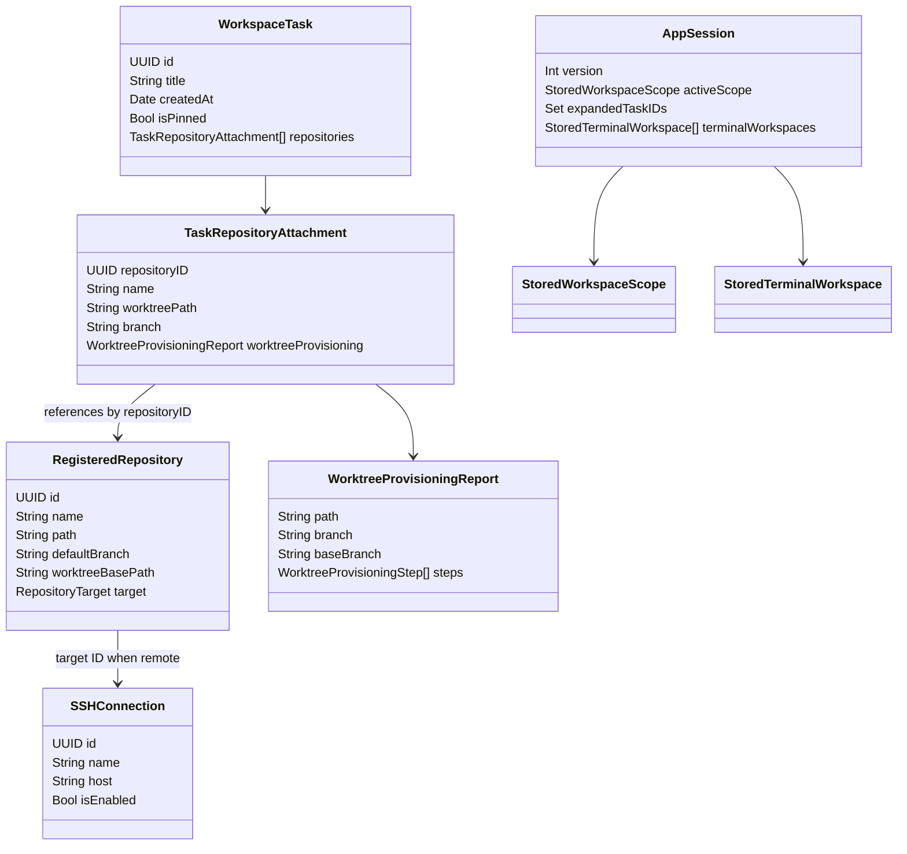
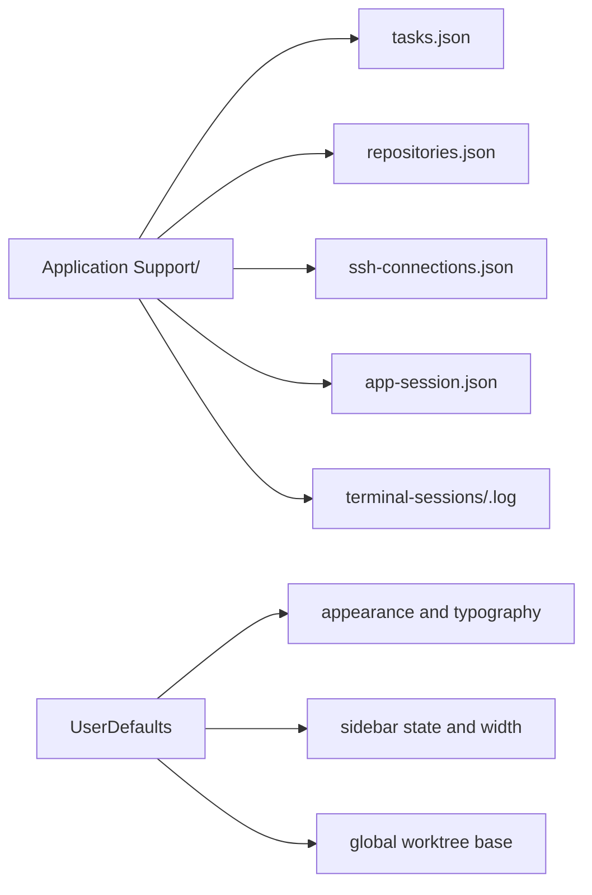
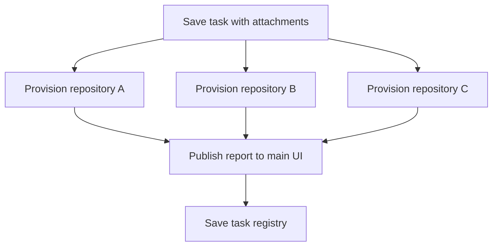
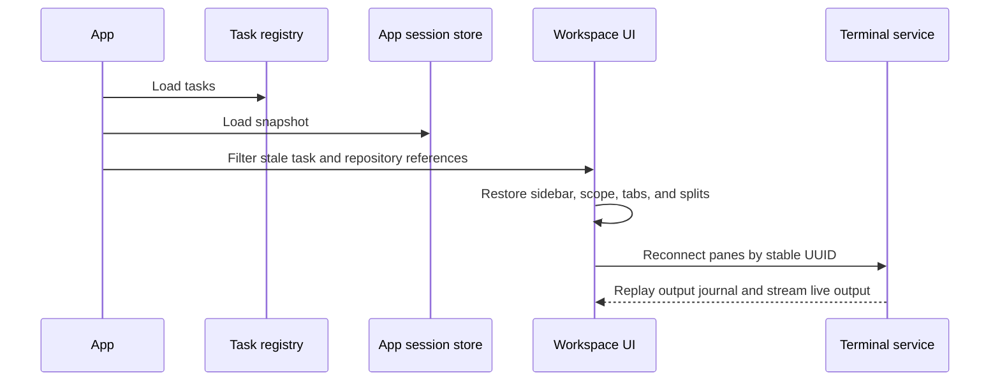

# Application architecture

## Runtime shape

Piñata is a Swift 6 AppKit application for macOS 14 or later. AppKit owns the window, menu bar, panels, focus, native controls, and application lifecycle. Ghostty owns terminal emulation and rendering.

## Ownership rules

| Owner | Owns | Does not own |
| --- | --- | --- |
| `PinataApp` | App lifecycle, menu installation, root workspace. | Task persistence or terminal pane layout. |
| `WorkspaceViewController` | Selected scope, task actions, provisioning coordination, terminal workspaces, app-session persistence. | Ghostty rendering or PTY I/O. |
| `PanelViewController` | Sidebar presentation and user gestures. | Registry data source of truth. |
| `TerminalViewController` | Terminal tab's split tree, panes, active pane, and pane actions. | Durable PTY process. |
| `GhosttySurfaceView` | Terminal rendering, keyboard encoding, terminal scrolling. | Shell process or output history. |
| `TerminalSessionService` | One pane's PTY, child process group, local socket, output journal. | AppKit views and saved UI layout. |
| Registry stores | Codable local data. | UI state or long-lived process state. |

The central rule is simple: UI controllers project persisted task data and live terminal data, but do not become the durable owner of shell processes.

## Data model

`TaskRepositoryAttachment` intentionally stores the attachment name, worktree path, branch, and latest provisioning report. This lets the sidebar and failure state remain understandable even while repository inspection is unavailable or a worktree operation fails.

## Local persistence

All persisted data is local to the macOS user account.

| Data | Store | Written when |
| --- | --- | --- |
| Tasks, attachment order, pins, worktree metadata | `tasks.json` | Task create, edit, reorder, provision, detach, delete. |
| Registered repositories and overrides | `repositories.json` | Repository registration or settings edit. |
| SSH connection names, aliases, and enabled state | `ssh-connections.json` | Connection edit or enable change. |
| UI and terminal layout snapshot | `app-session.json` | Relevant workspace change, with a short coalescing delay, and app termination. |
| Terminal output journal | Per-pane log | Terminal service receives PTY output. |
| Appearance and small UI preferences | `UserDefaults` | Settings or sidebar presentation change. |

JSON writes use atomic replacement. Session files use a version number. An unsupported version is ignored rather than decoded as a partially compatible layout.

## Worktree concurrency

The app persists the task before starting Git work. It then starts independent provisioning operations for each new attachment. Each operation sends report updates back to the main UI, where the task registry is updated and rendered.

This design means one failed repository does not make the others fail or wait. The task's state is the composition of its attachment states.

## Session restoration

At startup, the workspace loads tasks first, then loads the optional session snapshot. It discards snapshot references to tasks or attachments that no longer exist, restores the valid expanded state and selected scope, then recreates terminal workspaces and split panes.

The snapshot preserves UI topology, not process memory. See [Terminal session architecture](terminal-session-architecture.md) for the recovery contract.

## Main-thread and background work

- AppKit views and user interaction stay on the main actor.
- Git provisioning runs away from the UI, while each report update returns to the main UI before mutation.
- Remote Git provisioning uses the registered OpenSSH alias with non-interactive authentication. SSH credentials remain outside Piñata.
- The durable terminal service runs as a separate process. Socket I/O and PTY reads avoid blocking AppKit rendering.
- Registry and session stores are synchronous local file operations invoked at clear state boundaries.

## Error handling

Piñata keeps error state with the resource that failed:

| Failure | User-visible result | Recovery |
| --- | --- | --- |
| Fetch, branch, or worktree failure | Failed repository attachment with concise error. | Retry provisioning. |
| Detach or task cleanup failure | Deleting or failed state remains visible. | Retry cleanup. |
| Missing terminal service | Terminal shows a local service message. | Reconnect or create a fresh service. |
| Invalid session snapshot | Ignore unsupported or stale entries. | Restore the remaining valid UI. |

The app does not treat a failed attachment as a failed task. It only marks the affected attachment as failed.

## Architecture boundaries

Do not put the following in current production code until the feature exists:

- Pi worker management or agent transcript storage.
- GitHub API workflows.
- A replacement terminal renderer or custom terminal scrollback.

Those proposed future capabilities live under [`docs/incoming/`](incoming/). Keeping them separate prevents current local behavior from depending on future infrastructure.
