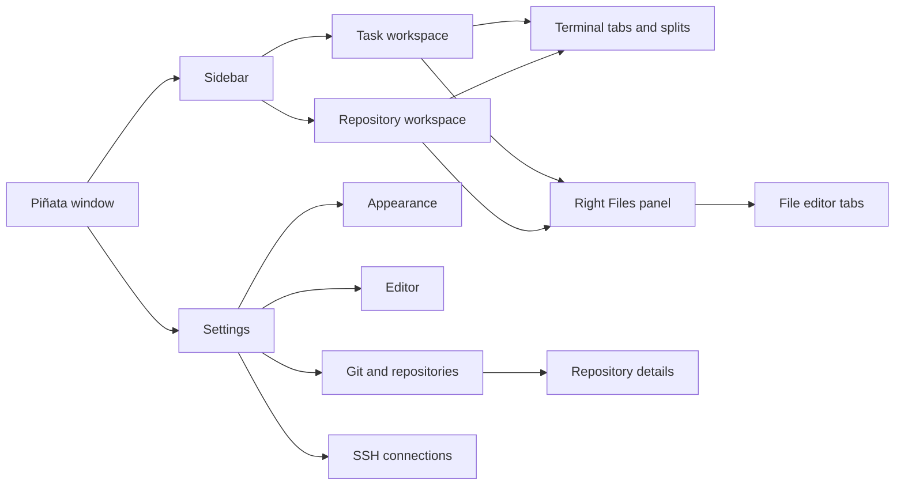
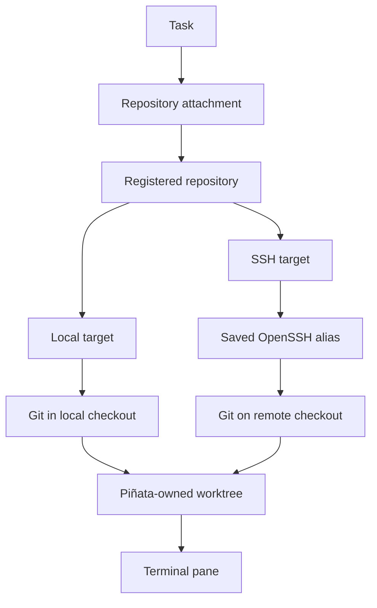
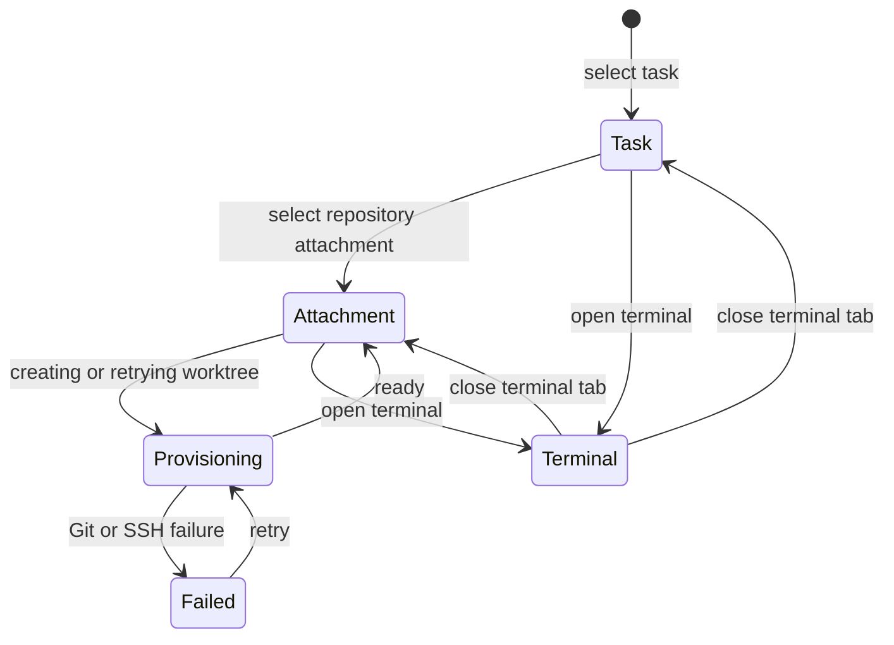
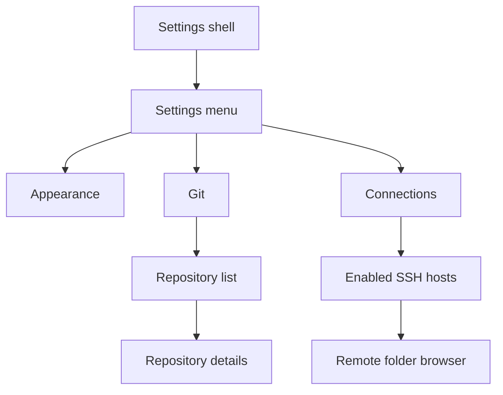

# Application map

This is the current, implemented UI map. Use it to locate a user flow before changing a view. For ownership and persisted schemas, read [Application architecture](application-architecture.md).

## Window routes

| Surface | Purpose | Primary action |
| --- | --- | --- |
| Sidebar | Browse pinned and unpinned tasks, then their attachments. | Select, reorder, open task actions. |
| Right workspace panel | Browse files for the selected task or attachment. | Open Files, expand folders, open a file, or resize the panel. |
| File editor tabs | Edit local or SSH text files in the active workspace. | Preview with a single click, open permanently with a double click, and save with `Cmd+S`. |
| Task workspace | Owns a task's terminal layout. | Open a task terminal or select an attachment. |
| Repository workspace | Shows one attachment's provisioning state or terminal layout. | Retry a failed worktree or open its terminal. |
| New task sheet | Creates a task with zero or more repository attachments. | Choose local or enabled SSH repositories. |
| Appearance | Changes theme, accent, and application and terminal font preferences. | Persist `UserSettings`. |
| Editor | Changes file preview behavior and editor font size. | Persist `UserSettings`. |
| Git | Sets the default worktree base and manages registered repositories. | Open repository details. |
| Connections | Reads SSH aliases from OpenSSH configuration and enables hosts. | Browse and register remote Git folders. |
| Repository details | Shows inspected Git metadata and repository overrides. | Change default branch or worktree base, remove registration. |

## Source map

| Area | Source | Responsibility |
| --- | --- | --- |
| App lifecycle | `PinataApp.swift` | Creates the workspace, menus, and settings window. |
| Workspace | `Workspace/` | Independent left and right panels, task and attachment selection, file browser, task sheets, session snapshot, and shared theme. |
| Settings | `Settings/` | Appearance, shared settings layout, repositories, worktree provisioning, and SSH connections. |
| Terminal | `Terminal/` | Ghostty integration, terminal tabs and splits, and zmx attachment. |

## Repository targets

The target is part of the registered repository, not the task attachment. A task can therefore combine local and SSH-backed repositories. A remote target stores a connection ID; the connection stores only the selected OpenSSH alias and display state. Piñata never stores a key or password.

## Navigation and terminal lifecycle

Closing the app detaches from zmx and preserves the terminal layout. Closing a terminal tab or pane kills its zmx session. A local terminal attaches to bundled zmx. A remote terminal starts `ssh -tt <alias> zmx attach <pane-id>` and offers to install pinned zmx in `~/.local/bin` when absent.

The Files tab remains rooted at the selected workspace's initial working directory. Terminal `cd` commands do not move it. Repository attachments display the repository name even when the worktree folder uses a task slug.

## Settings hierarchy

The settings shell uses the same content gutter, section rhythm, and label/control columns for top-level and repository-detail pages. Repository detail pages add a breadcrumb in the shared content header.

## Persistence at a glance

| Data | Local store | Notes |
| --- | --- | --- |
| Tasks and attachments | `tasks.json` | Includes worktree path, branch, and latest provisioning report. |
| Registered repositories | `repositories.json` | Includes local or SSH target and worktree override. |
| SSH connections | `ssh-connections.json` | Stores display name, OpenSSH alias, and enabled state only. |
| Workspace and terminal layout | `app-session.json` | Restores valid task, attachment, tab, and split references. |
| File-tree cache | `file-tree-cache-v1.json` | Bounded local and SSH listings plus expanded paths, keyed by root and target. |
| Appearance and panel preferences | `UserDefaults` | Theme, accent, application, terminal, and editor typography, preview behavior, icon color, sidebar presentation, panel widths, global worktree base, and task branch prefix. |

All files are per-user under Application Support, except `UserDefaults`. zmx owns live terminal state and scrollback outside Piñata's stores.

See [File browser architecture](file-browser-architecture.md) for cache, refresh, and performance behavior.
