# Piñata Architecture

This document is the map of the current app. It explains what each layer owns, how data moves
through the Tauri and Vue boundary, and where to start when changing a feature.

## Contents

- [Product Shape](#product-shape)
- [Runtime Stack](#runtime-stack)
- [Source Tree](#source-tree)
- [Ownership Boundaries](#ownership-boundaries)
- [App Boot Lifecycle](#app-boot-lifecycle)
- [Root Render Tree](#root-render-tree)
- [AppShell Orchestration](#appshell-orchestration)
- [Persistent App State](#persistent-app-state)
- [Settings State](#settings-state)
- [Tauri Command Boundary](#tauri-command-boundary)
- [Native Menu And Window Behavior](#native-menu-and-window-behavior)
- [Settings Lifecycle](#settings-lifecycle)
- [Onboarding Lifecycle](#onboarding-lifecycle)
- [Repository Registration Lifecycle](#repository-registration-lifecycle)
- [Worktree Path Rules](#worktree-path-rules)
- [Task Sidebar Interaction Model](#task-sidebar-interaction-model)
- [Task Creation Lifecycle](#task-creation-lifecycle)
- [Task Edit Lifecycle](#task-edit-lifecycle)
- [Task Deletion Lifecycle](#task-deletion-lifecycle)
- [Git Progress Events](#git-progress-events)
- [Modal and Overlay Rules](#modal-and-overlay-rules)
- [Styling System](#styling-system)
- [Feature Specs](#feature-specs)
- [Where To Change Things](#where-to-change-things)
- [Future Terminal Fit](#future-terminal-fit)
- [Current High-Impact Operations](#current-high-impact-operations)
- [Mental Model](#mental-model)

## Product Shape

Piñata is a terminal-first macOS workbench. The core product model is:

```text
Task
+-- Task repo
    +-- Registered repository config
    +-- Task-owned git branch
    +-- Task-owned worktree
    +-- Future terminal tabs and splits
```

The app does not own agent output. The future terminal surface should be a real shell where users
start `pi`, `claude`, `codex`, or any other harness themselves.

## Runtime Stack

| Layer | Technology | Main files | Owns |
|---|---|---|---|
| Native app | Tauri 2 | `src-tauri/src/lib.rs` | macOS menu, command registration, native plugins |
| Backend | Rust | `src-tauri/src/app_state.rs`, `src-tauri/src/repository.rs` | persisted app state, git inspection, branch and worktree commands |
| Frontend | Vue 3 + TypeScript | `src/main.ts`, `src/App.vue`, `src/shell/app-shell/AppShell.vue` | UI tree, product flows, state orchestration |
| Styling | CSS modules + tokens | `src/styles/*`, `*.module.css` | themes, spacing, typography, flat visual system |
| Shared UI | Vue components | `src/components/*`, `src/icons/*` | reusable controls and icons |

## Source Tree

```text
.
+-- docs/
|   +-- architecture.md
|   +-- design/Pinata.html
+-- src/
|   +-- assets/                 # logo, app icon, bundled fonts
|   +-- components/             # shared app-level UI components
|   +-- features/
|   |   +-- app-state/          # durable schema, TS helpers, Tauri invokers
|   |   +-- onboarding/         # first-run setup flow
|   |   +-- settings/           # full-screen settings surface
|   |   +-- task-sidebar/       # left task panel and task dialog
|   +-- icons/                  # centralized SVG icon components
|   +-- shell/
|   |   +-- app-shell/          # root orchestrator
|   |   +-- main-surface/       # center placeholder until terminal lands
|   |   +-- side-panel/         # generic right side panel scaffold
|   |   +-- title-bar/          # custom macOS title bar
|   +-- styles/                 # design tokens, themes, globals
|   +-- App.vue                 # mounts AppShell
|   +-- main.ts                 # Vue entrypoint
+-- src-tauri/
    +-- src/
    |   +-- app_state.rs        # app-state.json load/save
    |   +-- repository.rs       # git inspection and task worktree commands
    |   +-- lib.rs              # Tauri setup, menu, command registration
    |   +-- main.rs             # native entrypoint
    +-- tauri.conf.json
```

## Ownership Boundaries

| Concern | Owner | Reason |
|---|---|---|
| Visual state, modals, selection, keyboard shortcuts | Vue | It is UI state and needs immediate rendering |
| Durable product state | Rust file, shaped by TS helpers | Rust reads and writes the app data JSON file |
| Theme, accent, accent intensity | `localStorage` through `settings.ts` | User preference, cheap synchronous startup read |
| First-run onboarding flag | `localStorage['pinata.onboarded.v1']` | Only gates whether onboarding appears |
| Git repository inspection | Rust | Needs local filesystem and `git` access |
| Branch and worktree creation/deletion | Rust | High-impact filesystem operations stay native and testable |
| Branch/worktree transaction orchestration | Vue `AppShell` | It coordinates UI progress, rollback calls, and final app-state save |

## App Boot Lifecycle

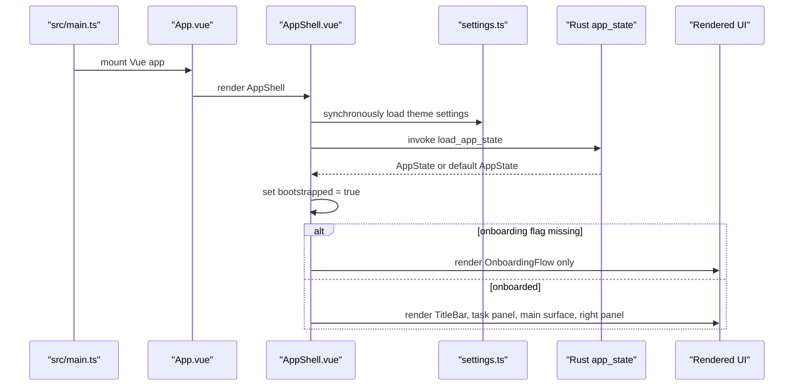

Important detail: app chrome waits for `bootstrapped`. This prevents the empty scaffold from
flashing before persisted state loads.

## Root Render Tree

Normal app mode:

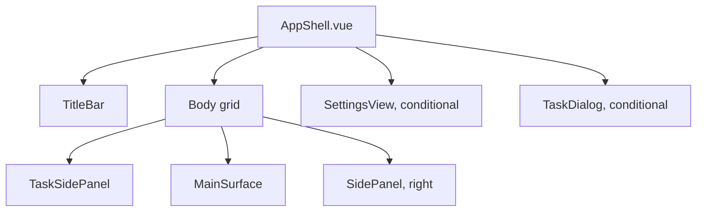

First-run mode:

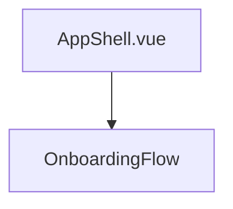

Onboarding is exclusive. It does not render behind the normal app shell.

## AppShell Orchestration

`AppShell.vue` is the only place that coordinates durable product changes across features.
Feature components emit intent. `AppShell` decides what state changes, what Rust command runs, and
when app state is saved.

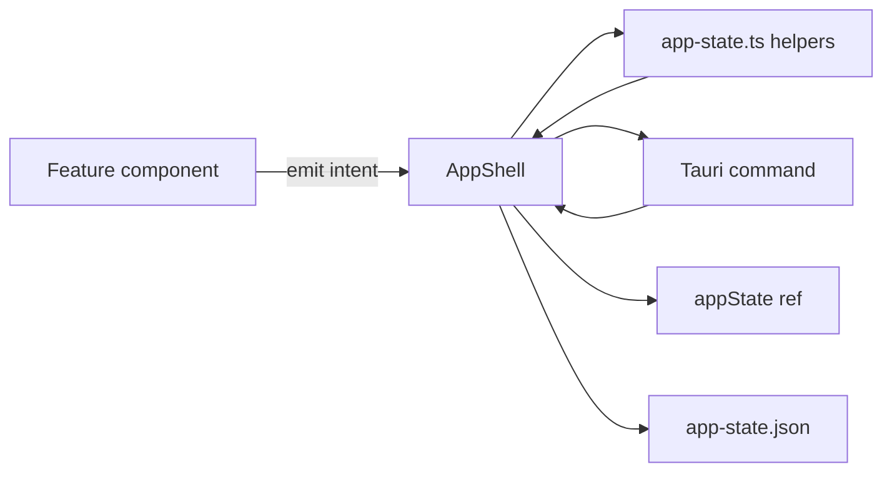

Current `AppShell` responsibilities:

| Area | State or function | Notes |
|---|---|---|
| Panels | `leftSidePanelVisible`, `rightSidePanelVisible` | Header shortcuts and buttons toggle these |
| Settings | `settingsVisible`, `settings` | Settings values come from `localStorage` |
| Onboarding | `onboardingVisible` | First-run flow owns the screen until completed |
| Task modal | `newTaskVisible`, `editingTaskId`, `taskDialogProgress` | One dialog handles create, edit, delete, and git progress |
| App state | `appState`, `persistAppState`, `persistAppStateAsync` | Fire-and-forget for low-risk UI edits, awaited for task git transactions |
| Git progress | `listen('pinata://git-progress')` | Rust phase events update the running progress row |

This keeps feature components mostly presentational. `TaskDialog` validates form shape and asks for
confirmation, but it does not create branches, delete worktrees, or save `app-state.json` itself.

## Persistent App State

Rust stores product state in:

```text
~/Library/Application Support/dev.pinata.desktop/app-state.json
```

The TypeScript and Rust schemas mirror each other.

```ts
type AppState = {
  version: 1
  repositoryDefaults: {
    worktreeBasePath: string
  }
  repoRegistry: RegisteredRepo[]
  tasks: Task[]
  selection: {
    taskId: string | null
    taskRepoIdByTaskId: Record<string, string | null>
    expandedTaskIds: string[]
  }
}

type RegisteredRepo = {
  id: string
  name: string
  org?: string
  description?: string
  source: { kind: 'local'; path: string }
  branches: string[]
  defaultBranch: string
  worktreeBasePath?: string
  githubAccount?: string
}

type Task = {
  id: string
  name: string
  color: string
  repos: TaskRepo[]
}

type TaskRepo = {
  id: string
  registeredRepoId: string
  baseBranch: string
  branch: string
  worktreePath?: string
}
```

State rules:

- `repoRegistry` is global repository config.
- `TaskRepo` is a repository instance inside one task.
- Selection points to `TaskRepo.id`, not `RegisteredRepo.id`.
- Registered repository removal is blocked while any task references it.
- Task branch identity is immutable after the row is created.
- Task rename does not rename existing branches or move existing worktrees.
- Terminal tabs are not in app state yet.

Write behavior:

- `load_app_state` returns the default empty state when the file does not exist.
- `save_app_state` rejects unsupported schema versions, creates the app data directory if needed,
  then writes pretty JSON directly.
- Low-risk interactions call `persistAppState`, which updates the Vue ref immediately and logs save
  failures.
- Git transactions call `persistAppStateAsync`, so the modal closes only after git work and the
  final state save both succeed.

## Settings State

Settings live in:

```text
localStorage['pinata.settings.v1']
```

Current settings:

```ts
type AppSettings = {
  theme: 'pinata-dark' | 'pinata-light'
  accent: 'coral' | 'teal' | 'gold' | 'magenta' | 'lime' | 'azure' | 'mono'
  accentIntensity: 'transparent' | 'balanced' | 'vibrant'
}
```

`AppShell` applies these values as data attributes on the root shell:

```html
<div data-theme="pinata-dark" data-accent="coral" data-accent-intensity="balanced">
```

Theme CSS reads those attributes and exposes semantic tokens like `--color-accent-primary`,
`--color-surface-primary`, and `--color-text-secondary`.

## Tauri Command Boundary

Vue calls Rust through typed wrappers in `src/features/app-state/app-state.ts`.

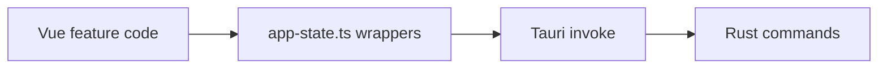

Registered commands:

| Command | Rust file | Purpose |
|---|---|---|
| `load_app_state` | `app_state.rs` | Read app-state JSON from app data dir |
| `save_app_state` | `app_state.rs` | Write app-state JSON |
| `inspect_repository` | `repository.rs` | Validate git checkout, infer repo metadata |
| `create_task_repo_worktree` | `repository.rs` | Create task-owned branch and worktree |
| `delete_task_repo_worktree` | `repository.rs` | Remove task-owned worktree and branch |

## Native Menu And Window Behavior

`src-tauri/src/lib.rs` owns native app setup:

- Registers the Rust commands above.
- Installs the dialog plugin used by Settings and Onboarding folder pickers.
- Builds the macOS app menu, including `Settings...` with `CmdOrCtrl+,`.
- Emits `pinata://open-settings` when the native Settings menu item is selected.

`AppShell` listens for `pinata://open-settings` and opens `SettingsView`.

Window dragging is handled in every top-level surface that can cover the title bar:

| Surface | Drag owner |
|---|---|
| Normal app | `TitleBar.vue` |
| Settings | `SettingsView.vue` drag region |
| Onboarding | `OnboardingFlow.vue` drag region |
| Task dialog, including blocking git progress | `TaskDialog.vue` drag region |

Default rule: future full-screen or modal surfaces must keep the top title-bar height draggable.

## Settings Lifecycle

Settings has two kinds of data:

```text
User preferences:
  localStorage['pinata.settings.v1']

Product registry:
  app-state.json via emit('update-app-state')
```

Appearance edits update `theme`, `accent`, and `accentIntensity` immediately. `AppShell` reflects
them as root `data-*` attributes so CSS tokens update without a reload.

Git & PR edits update durable app state:

- Global worktree base validates on change, then saves to `repositoryDefaults.worktreeBasePath`.
- Register repo opens a modal, validates the folder through `inspect_repository`, then appends a
  `RegisteredRepo`.
- Registered repo rows open a modal with source path, org, default branch, worktree override, and
  danger-zone removal.
- Default branch and per-repo worktree override apply from their field change after validation.
- Repository removal deletes only the registry entry and is disabled while any task references it.

## Onboarding Lifecycle

Onboarding is gated by:

```text
localStorage['pinata.onboarded.v1']
```

First run uses default settings from `settings.ts`: Piñata Dark, Coral, Balanced. The normal app
chrome is not rendered behind onboarding.

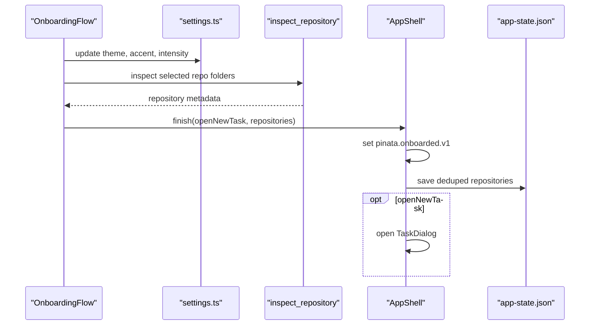

Repository rows collected during onboarding are temporary until finish. Finish de-dupes against the
current registry by name and canonical path before saving.

## Repository Registration Lifecycle

Registration happens from Settings or Onboarding.

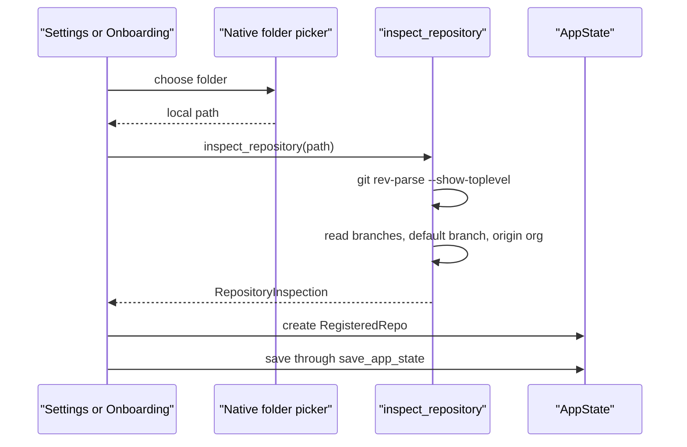

Validation:

- Non-git folders are rejected.
- Paths are canonicalized by Rust.
- Duplicate registration is blocked by repo name or canonical path.
- `org` is inferred only for GitHub remotes today.

## Worktree Path Rules

There are three levels:

```text
Global default:
  ~/.pinata/worktrees

Registered repo effective base:
  repo.worktreeBasePath ?? <global default>/<repo name>

Task repo worktree:
  <effective repo base>/<6-char task-id hash>-<task slug>
```

Repo-local override rule:

```text
./worktrees
```

means:

```text
<registered repo source path>/worktrees
```

Example:

```text
repo source path: /Users/me/dev/api
override:         ./worktrees
effective base:   /Users/me/dev/api/worktrees
task worktree:    /Users/me/dev/api/worktrees/a1b2c3-auth-fix
```

The task worktree leaf comes from the immutable task branch. This is why editing a task name later
does not silently move an already-planned or already-created worktree.

## Task Sidebar Interaction Model

The left side panel is the task navigation surface.

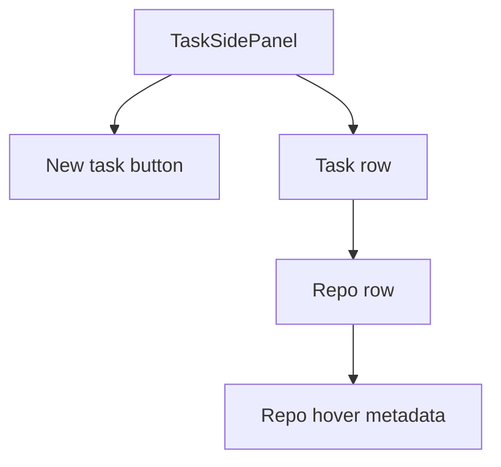

Interaction rules:

- New Task opens `TaskDialog` in create mode.
- Clicking a task row toggles expand or collapse, it does not select the first repo.
- Clicking a repo row selects that `TaskRepo`.
- Expanded task ids and selected task repo ids persist in app state.
- Repo hover metadata shows branch, base branch, and planned or persisted worktree path.
- During blocking task git work, the working task shows progress and repo selection highlight is
  suppressed.

## Task Creation Lifecycle

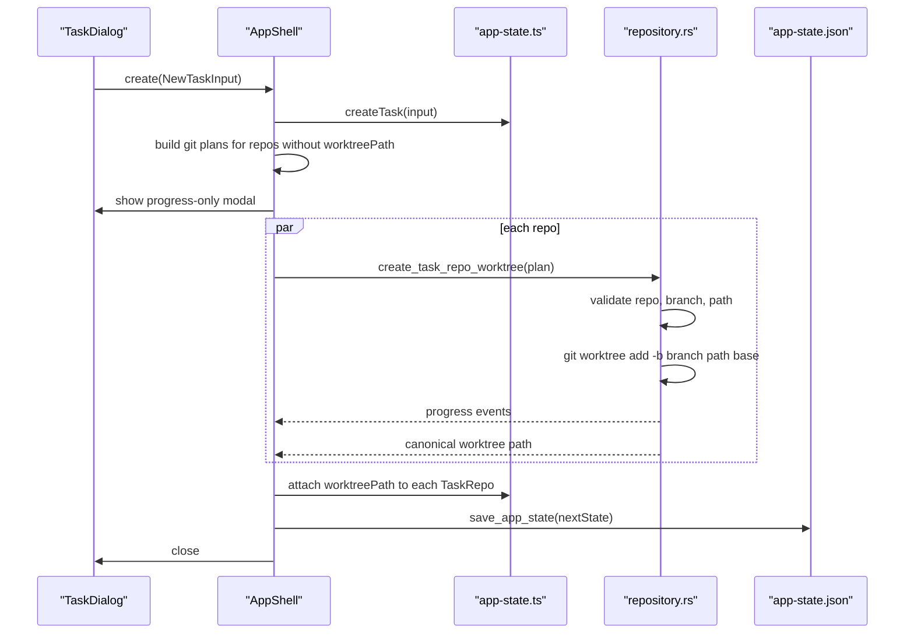

Creation is synchronous from the user's point of view. The modal stays open until git work finishes.

Parallelism:

- Repositories run in parallel.
- Inside one repository, branch creation and worktree creation are one sequential `git worktree add`
  operation.

Failure behavior:

- If a repo fails, the modal shows the error and returns to the form only when the user chooses.
- Repos that succeeded in the same transaction are rolled back with `delete_task_repo_worktree`.
- App state is not saved until all git work succeeds.
- Rust also cleans up a partially-created worktree and branch if `git worktree add` fails after
  creating them.

## Task Edit Lifecycle

Task edit reuses the same dialog and transaction path.

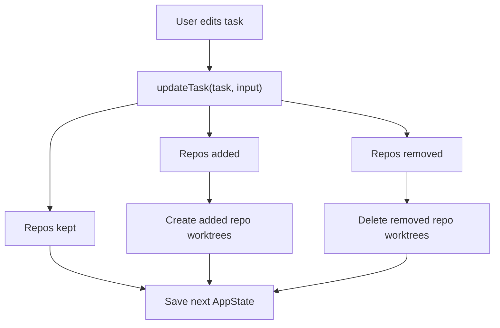

Rules:

- Existing repo rows keep their `TaskRepo.id`.
- Existing repo rows keep their `branch`.
- Existing materialized repo rows keep their `baseBranch`.
- Newly-added repos get the task id hash plus the current task name slug.
- Removing or replacing a saved repo row requires confirmation.

## Task Deletion Lifecycle

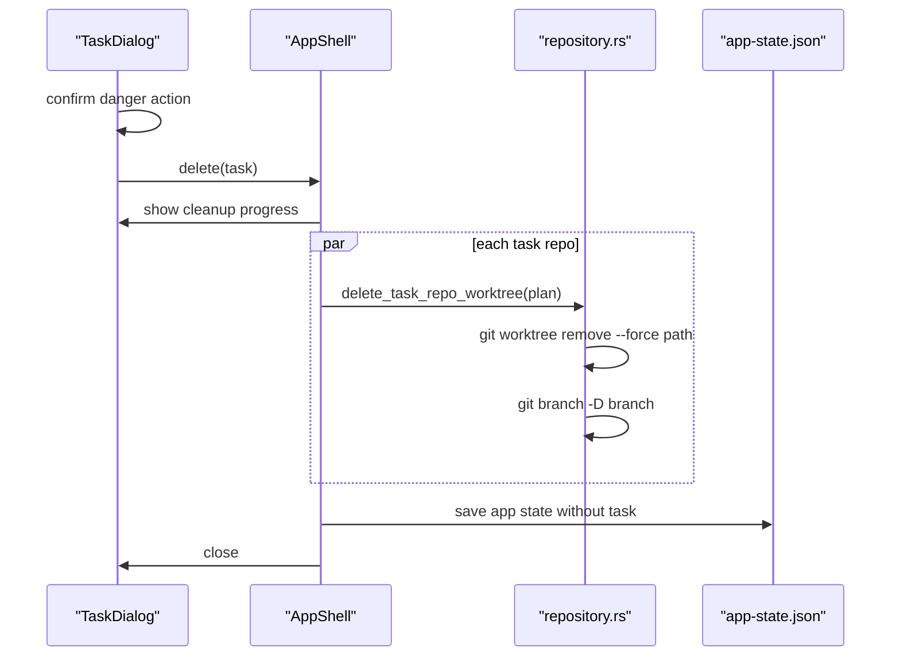

Deletion only targets task-owned branches and worktrees. Registered repositories and their source
folders stay untouched.

## Git Progress Events

Rust emits:

```text
pinata://git-progress
```

Payload:

```ts
type GitProgressEvent = {
  progressId: string
  phase: string
}
```

Rust reads `git worktree add` stdout and stderr and maps raw output to friendly phases. Current
examples:

| Raw signal | UI phase |
|---|---|
| `Preparing worktree` | `Preparing worktree` |
| `Updating files:` | `Updating files` |
| `post-checkout` | `Repository hooks` |
| `installing dependencies` | `Installing dependencies` |
| `┌ Linking the project` | `Linking project` |
| `┌ Building the project` | `Building project` |
| `┌ Checking constraints` | `Checking constraints` |

The UI never displays raw hook output in the progress rows.

## Modal and Overlay Rules

All full-screen overlays are mounted from `AppShell`.

Current overlays:

- `SettingsView`
- `TaskDialog`
- `OnboardingFlow`, exclusive during first run

Rules:

- Keep overlays flat. No shadows.
- Keep the top `--titlebar-height` draggable even during blocking progress.
- Outside-click close should be based on pointer down and pointer up both starting outside, not just
  releasing outside.
- Blocking git progress disables close actions until the transaction finishes or fails.

## Styling System

Piñata uses global design tokens plus CSS modules.

Core files:

| File | Purpose |
|---|---|
| `src/styles/tokens.css` | spacing, radius, font scale, layout sizes |
| `src/styles/themes.css` | theme and accent semantic colors |
| `src/styles/typography.css` | bundled font faces |
| `src/styles/density.css` | density hook for future terminal settings |
| `src/styles/globals.css` | global reset and shared button classes |
| `src/styles/spec.md` | design system rules |

Rules:

- Prefer semantic tokens over raw colors.
- Prefer spacing tokens over hardcoded pixel values.
- Use `uiButton` classes for buttons.
- Use `src/components` for shared controls used by multiple features.
- Use `src/icons` for icons.
- No shadows. Separation comes from fill, border, and spacing.

## Feature Specs

Each feature keeps a local `spec.md` close to its code.

| Spec | Describes |
|---|---|
| `src/shell/spec.md` | frame, keyboard, overlays, title bar, layout |
| `src/features/app-state/spec.md` | persisted product state and invariants |
| `src/features/onboarding/spec.md` | first-run flow |
| `src/features/settings/spec.md` | settings pages and repo registry |
| `src/features/task-sidebar/spec.md` | task panel, task dialog, task git work |
| `src/styles/spec.md` | visual design system |

Use this file for the big picture. Use feature specs when changing one feature.

## Where To Change Things

| Goal | Start here | Usually also touches |
|---|---|---|
| Add a durable app-state field | `src/features/app-state/app-state.ts` | `src-tauri/src/app_state.rs`, app-state spec |
| Add a Rust command | `src-tauri/src/*.rs` | `src-tauri/src/lib.rs`, TS wrapper in `app-state.ts` |
| Change task create/edit/delete | `src/shell/app-shell/AppShell.vue` | `TaskDialog.vue`, app-state helpers, task-sidebar spec |
| Change task sidebar visuals | `TaskSidePanel.vue` | `TaskSidePanel.module.css`, task-sidebar spec |
| Change settings | `SettingsView.vue` | `settings.ts`, settings spec |
| Change onboarding | `OnboardingFlow.vue` | onboarding spec |
| Change theme or spacing | `src/styles/*` | styles spec |
| Add reusable visual control | `src/components/<control>` | feature imports |
| Add icon | `src/icons/<Name>Icon.vue` | consuming component |

## Future Terminal Fit

The terminal feature should fit this structure without renaming the current model.

Likely shape:

```text
src/features/terminal/
+-- spec.md
+-- terminal-state.ts
+-- TerminalSurface.vue
+-- TerminalSurface.module.css
```

Expected ownership:

- `AppShell` keeps selecting task and task repo.
- `MainSurface` becomes the host for selected task repo terminal tabs.
- Rust owns native process/session plumbing for whatever terminal backend ships.
- Vue owns tab layout, split panes, focus, and keyboard routing.
- App state should persist durable terminal layout only when that feature ships.
- No agent RPC or terminal scraping should be introduced as a product dependency.

## Current High-Impact Operations

| Operation | Why high impact | Current guard |
|---|---|---|
| Delete task | Deletes task-owned branches and worktrees | Confirmation modal |
| Remove saved repo from task | Deletes that task repo branch and worktree when present | Confirmation modal |
| Replace saved repo in task | Deletes old task repo branch and worktree when present | Confirmation modal |
| Remove registered repo from Settings | Could orphan tasks | Disabled while referenced by any task |
| Change repo worktree base | Affects future task worktrees | Help copy, no existing worktrees moved |

## Mental Model

Keep this split clear:

```text
RegisteredRepo
  "This local checkout exists and Piñata can use it."

Task
  "This is the unit of work the user wants to ship."

TaskRepo
  "This task uses this registered repo with this base branch,
   task branch, and task worktree."
```

Most bugs come from mixing those three levels.
