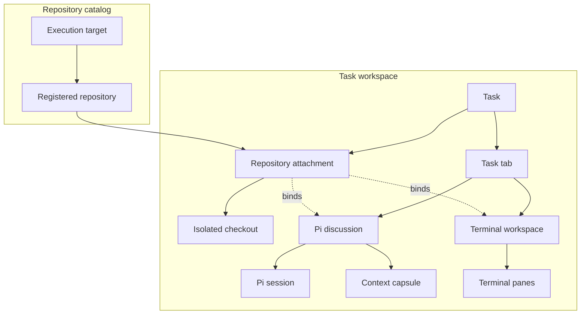
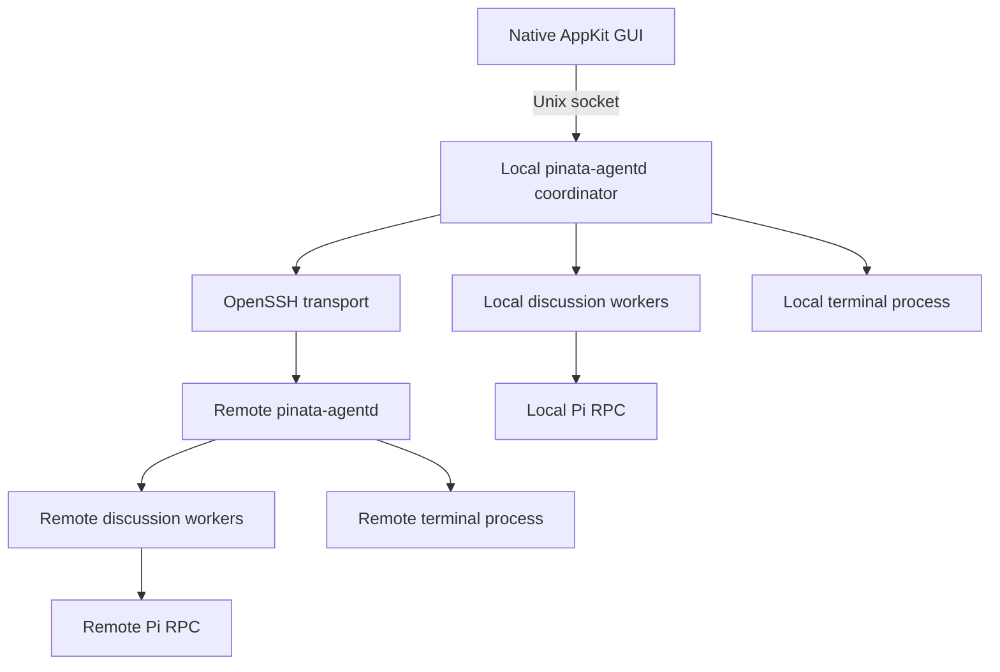
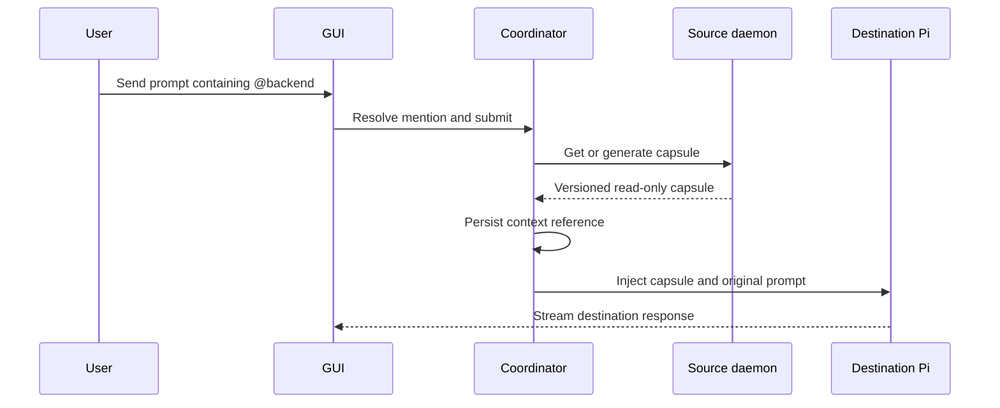

# Piñata Pi Harness Architecture and Implementation Blueprint

Status: incoming proposal, future Pi Harness architecture. It does not describe current app behavior.
Last updated: 2026-08-09
Target: native macOS Piñata, macOS 14+

## 1. Purpose

This document is the proposed implementation blueprint for moving Piñata from its current Ghostty terminal-first shell to a durable native UI for the Pi coding harness. It is intentionally separated from the current architecture documents because none of the Pi Harness phases are implemented yet.

The target product has these properties:

- A task is the top-level unit of work.
- A task may attach zero, one, or many repositories.
- A task contains one or more durable tabs.
- Every tab is either a Pi discussion or a terminal workspace.
- A discussion is a Pi session with a native conversation UI.
- A terminal tab remains a complete first-class Ghostty workspace.
- Multiple discussions may use the same repository through isolated Git worktrees.
- Multiple discussions may use different repositories for one feature.
- Discussions may reference each other through explicit `@discussion` context links.
- Local and SSH execution use the same application and daemon contracts.
- Quitting and reopening Piñata restores every task, discussion, terminal, and completed transcript.
- Active work continues after the GUI disconnects.

This is an implementation plan, not an invitation to rewrite the entire application at once. Each phase must leave the application buildable and the current terminal usable.

### How to use this document

Read this document in layers:

1. **Understand the product:** read the current baseline, product hierarchy, task creation, terminal architecture, and roadmap.
2. **Design or implement a feature:** use the domain schema, source-of-truth table, and runtime topology.
3. **Build the future Pi Harness:** follow the roadmap phase by phase, including its acceptance criteria.

The detailed schema and protocol sections are reference material. They define boundaries and persistence rules, but the hierarchy below is the fastest way to understand the product.

## 2. Product decisions

The following decisions are normative unless a later ADR replaces them.

1. **Task remains the feature-level container.** Do not add a separate `FeatureWorkspace` type.
2. **Discussion and terminal are first-class tab types.** Creating a tab explicitly creates either one.
3. **The GUI never owns durable processes.** A background daemon owns Pi workers and terminal sessions.
4. **Local mode uses the same daemon boundary as remote mode.** SSH adds a target transport, not a second application architecture.
5. **Pi runs beside the repository.** Local repositories use local Pi workers. Remote repositories use Pi workers on the remote host.
6. **Pi session JSONL is canonical agent history.** Piñata does not invent a second conversation format.
7. **Piñata stores a lossless event journal.** It preserves streaming, tool lifecycle, durations, errors, and reconnect cursors.
8. **UI grouping is a projection.** Raw Pi messages and events are never discarded because the current UI hides them.
9. **Every editable discussion gets its own worktree.** Two agents must not mutate one checkout concurrently.
10. **Cross-discussion references are read-only by default.** Referencing another discussion never starts work or modifies its repository implicitly.
11. **Context references are immutable snapshots.** A prompt records the exact source discussion sequence and repository revision used.
12. **Terminal layout persistence reconnects native shells.** App session restore preserves layout and working directories, while zmx owns each live PTY. See [terminal session architecture](../terminal-session-architecture.md).

## 3. Current baseline

The current native branch already provides:

- Swift 6 and AppKit lifecycle.
- Native window, menus, panels, tabs, focus, and settings.
- Embedded Ghostty surfaces.
- Multiple terminal tabs.
- AppKit-managed terminal splits.
- Durable local app-session snapshots for selected scope, expanded tasks, terminal tabs, split layout, and active pane.
- Restored terminal panes reconnect to their existing local or remote zmx session while its host is still running.
- A durable local task store with pinned-task ordering.
- Task creation, rename, pinning, repository attachment, detachment, and deletion.
- A repository registry with branch, remote, tag, and worktree metadata.
- Per-task worktree provisioning from a freshly fetched default branch.
- Configurable global and per-repository worktree roots.
- Parallel provisioning status, failure details, and retry handling.
- Safe removal limited to Piñata-owned worktrees and branches.

The main current constraints are:

- `PinataApp` eagerly creates `GhosttyRuntime`.
- `WorkspaceViewController` owns `TerminalTab` values directly.
- `WorkspaceViewController` persists terminal workspace snapshots, while `TerminalViewController` owns the live AppKit pane tree.
- Ghostty owns terminal emulation and rendering. zmx owns each PTY, so native scrolling and terminal behavior are preserved across GUI detachment.
- Repository inspection invokes local `git` and `FileManager` directly.
- Stale app-session references are ignored when their task or repository attachment no longer exists.
- Tabs represent terminal controllers instead of durable discussions.
- There is no discussion store or Pi RPC transport. zmx owns durable PTYs, but there is no general Pi coordinator daemon yet.

### 3.1 Implementation status

The task and Git worktree capabilities above are implemented in the current app. The schema, daemon boundary, discussion model, remote execution, and phase roadmap in the rest of this document remain proposed. They are not a description of shipped behavior.

The historical `backup-rpc-history` branch is useful prior art. It proved:

- `pi --mode rpc` process management.
- Prompt streaming.
- Session restoration with `get_state` and `get_messages`.
- Tool execution events.
- Extension UI requests.
- Model and thinking controls.
- Pi event fixtures and a render coverage matrix.

Do not port its flat `TimelineItem` architecture. It had separate live and restore projection paths and lost structured content such as thinking, interleaved blocks, custom messages, diff details, compaction state, queue state, and unknown extension output. Reuse its fixtures and protocol lessons.

## 4. Product hierarchy

### Read this first

Piñata has two levels of organization:

1. **Repository catalog:** an execution target identifies a machine, and a registered repository identifies reusable source code on that machine.
2. **Task workspace:** a task represents the user's goal. It can attach catalog repositories and contains the discussion and terminal tabs used to complete that goal.

An attachment is a named link from a task to a repository, such as `backend`. It is not a worktree. An editable discussion gets its own checkout from that attachment. A terminal can use task scratch space, a repository root, or an existing checkout.



Read it from left to right: a repository is registered once in the catalog, attached to a task, then used by a Pi discussion or terminal workspace. An attachment names a repository for the task. A checkout is a separate mutable worktree, not the attachment itself.

**Important boundary:** the task and worktree features in the current app are shipped. The daemon, discussions, Pi sessions, SSH targets, and context capsules in this diagram are the proposed next architecture.

Relationship rules:

- One target can host many registered repositories.
- One task can attach many registered repositories and contain many tabs.
- Every tab has exactly one content type: discussion or terminal workspace.
- One discussion owns one Pi session and, when editable, one isolated checkout.
- One terminal workspace can contain many terminal sessions, one per pane.
- A discussion publishes context capsules and consumes references to another discussion's capsules.

### 4.1 Task

A task represents one user goal or feature. It owns product-level organization, not an execution process.

Examples:

- Fix authentication timeout.
- Build checkout redesign.
- Investigate production memory growth.
- Plan an idea before attaching code.

A task may exist without a repository. Repository attachments may be added later.

### 4.2 Task repository

A task repository attaches a registered repository to a task and gives it a task-local alias such as `backend`, `frontend`, or `ios`.

It does not represent a mutable checkout. Discussions create isolated checkouts from the attachment.

### 4.3 Task tab

A task tab is an ordered top-level workspace entry. Its content is exactly one of:

- A Pi discussion.
- A terminal workspace.

The `+` action always asks which tab type to create. Neither type is represented as a mode of the other.

### 4.4 Discussion

A discussion is a durable Pi conversation inside one task.

A discussion has:

- One execution target.
- Zero or one primary task repository.
- One working directory.
- One Pi session.
- One task-local alias used by mentions.
- One event sequence.

A discussion without a repository uses a task scratch directory. Attaching a repository later should normally create a new repository-bound discussion rather than changing the working directory of an existing Pi session.

### 4.5 Terminal workspace

A terminal workspace is the durable content of one terminal tab. It owns:

- One execution target.
- One working-directory binding.
- One or more AppKit-managed panes.
- One persistent terminal session per pane.
- The split tree and active-pane selection.

A terminal workspace may use task scratch space, a registered repository root, a dedicated checkout, or an existing discussion checkout. Creating a terminal from a discussion creates a new terminal tab bound to that discussion's checkout. It does not replace the discussion UI.

### 4.6 Checkout

A checkout is a working tree used by one editable discussion or one standalone terminal workspace.

For a registered repository at `/code/api`, a task and discussion may create:

```text
~/.pinata/worktrees/<repository-id>/<task-id>/<discussion-id>/
```

The exact root is configurable per repository and target.

### 4.7 Terminal session

A terminal session is one persistent shell pane inside a terminal workspace. Conversation and terminal tabs are separate, but both survive GUI detachment.

### 4.8 Context capsule

A context capsule is a bounded, versioned, read-only snapshot published by one discussion for consumption by another.

## 5. Domain schema

### 5.1 How to read the schema

The schema is deliberately complete, so it is not the best starting point for product understanding. Read it in this order:

1. `ExecutionTarget` and `RegisteredRepository` locate code.
2. `Task`, `TaskRepository`, and `TaskTab` model a user's workspace.
3. `Discussion`, `Checkout`, and `PiSession` model isolated agent work.
4. `TerminalWorkspace` and `TerminalSession` model durable shells.
5. `ContextCapsule` and `ContextReference` model read-only sharing between discussions.

The schema describes the proposed daemon-backed model. It does not imply that each type already exists in the current app.

The following Swift-like schema describes the application domain. Persisted JSON uses stable string enum values and UUID strings.

```swift
typealias TargetID = UUID
typealias RepositoryID = UUID
typealias TaskID = UUID
typealias TaskRepositoryID = UUID
typealias TaskTabID = UUID
typealias DiscussionID = UUID
typealias CheckoutID = UUID
typealias TerminalWorkspaceID = UUID
typealias TerminalSessionID = UUID

enum ExecutionTargetKind: String, Codable {
    case local
    case ssh
}

struct ExecutionTarget: Codable, Identifiable, Sendable {
    let id: TargetID
    var kind: ExecutionTargetKind
    var displayName: String
    var ssh: SSHTargetConfiguration?
    var capabilities: TargetCapabilities?
    var lastConnectedAt: Date?
}

struct SSHTargetConfiguration: Codable, Sendable {
    var hostAlias: String
    var expectedHostFingerprint: String?
    var remoteAgentRoot: String
}

struct TargetCapabilities: Codable, Sendable {
    var protocolVersion: Int
    var agentVersion: String
    var operatingSystem: String
    var architecture: String
    var hasGit: Bool
    var supportsPersistentTerminalStreams: Bool
    var hasPi: Bool
}

struct RepositoryLocator: Codable, Sendable {
    let targetID: TargetID
    let path: String
}

struct RegisteredRepository: Codable, Identifiable, Sendable {
    let id: RepositoryID
    var name: String
    var locator: RepositoryLocator
    var remoteURL: String?
    var organization: String?
    var defaultBranch: String
    var worktreeBasePath: String?
    var lastInspectedAt: Date?
}

enum TaskStatus: String, Codable {
    case active
    case completed
    case archived
}

struct Task: Codable, Identifiable, Sendable {
    let id: TaskID
    var title: String
    var initialRequest: String?
    var status: TaskStatus
    var taskRepositoryIDs: [TaskRepositoryID]
    var tabIDs: [TaskTabID]
    var createdAt: Date
    var updatedAt: Date
}

enum RepositoryAccess: String, Codable {
    case readOnly
    case editable
}

struct TaskRepository: Codable, Identifiable, Sendable {
    let id: TaskRepositoryID
    let taskID: TaskID
    let repositoryID: RepositoryID
    var alias: String
    var baseBranch: String
    var access: RepositoryAccess
}

struct TaskTab: Codable, Identifiable, Sendable {
    let id: TaskTabID
    let taskID: TaskID
    var title: String
    var content: TaskTabContent
    var order: Int
    var createdAt: Date
}

enum TaskTabContent: Codable, Sendable {
    case discussion(DiscussionID)
    case terminal(TerminalWorkspaceID)
}

enum DiscussionStatus: String, Codable {
    case idle
    case starting
    case running
    case waitingForInput
    case stopping
    case interrupted
    case failed
}

struct Discussion: Codable, Identifiable, Sendable {
    let id: DiscussionID
    let taskID: TaskID
    var primaryTaskRepositoryID: TaskRepositoryID?
    var alias: String
    var title: String
    var targetID: TargetID
    var workingDirectory: String
    var checkoutID: CheckoutID?
    var piSession: PiSessionReference?
    var status: DiscussionStatus
    var lastEventSequence: UInt64
    var createdAt: Date
    var updatedAt: Date
}

struct Checkout: Codable, Identifiable, Sendable {
    let id: CheckoutID
    let owner: CheckoutOwner
    let taskRepositoryID: TaskRepositoryID
    let path: String
    let branch: String
    let baseRevision: String
    var headRevision: String
    var createdAt: Date
}

enum CheckoutOwner: Codable, Sendable {
    case discussion(DiscussionID)
    case terminal(TerminalWorkspaceID)
}

struct PiSessionReference: Codable, Sendable {
    let sessionID: String
    let sessionFile: String
    var sessionName: String?
    var modelProvider: String?
    var modelID: String?
    var thinkingLevel: String?
}

enum TerminalWorkingDirectory: Codable, Sendable {
    case taskScratch(path: String)
    case repositoryRoot(taskRepositoryID: TaskRepositoryID, path: String)
    case checkout(checkoutID: CheckoutID, path: String)
}

struct TerminalWorkspace: Codable, Identifiable, Sendable {
    let id: TerminalWorkspaceID
    let taskID: TaskID
    var targetID: TargetID
    var workingDirectory: TerminalWorkingDirectory
    var terminalSessionIDs: [TerminalSessionID]
    var splitLayout: TerminalSplitLayout
    var activeTerminalSessionID: TerminalSessionID?
    var sourceDiscussionID: DiscussionID?
    var createdAt: Date
    var updatedAt: Date
}

enum TerminalSplitAxis: String, Codable, Sendable {
    case horizontal
    case vertical
}

indirect enum TerminalSplitLayout: Codable, Sendable {
    case pane(TerminalSessionID)
    case split(
        axis: TerminalSplitAxis,
        ratio: Double,
        first: TerminalSplitLayout,
        second: TerminalSplitLayout
    )
}

enum TerminalSessionStatus: String, Codable {
    case starting
    case running
    case detached
    case exited
    case failed
}

struct TerminalSession: Codable, Identifiable, Sendable {
    let id: TerminalSessionID
    let terminalWorkspaceID: TerminalWorkspaceID
    let targetID: TargetID
    let workingDirectory: String
    let persistentTerminalID: String?
    var title: String
    var status: TerminalSessionStatus
    var exitCode: Int32?
}
```

### 5.2 Identifier and alias rules

- IDs never change.
- Aliases may change.
- Task repository aliases are unique inside a task.
- Discussion aliases are unique inside a task.
- Mention parsing resolves IDs at send time and stores the resolved ID.
- Persisted references never rely on a mutable alias.
- Remote target identity includes a verified SSH host fingerprint, not only a hostname.

## 6. Source of truth

| Data | Canonical owner | Local cache |
|---|---|---|
| Task catalog | Local coordinator daemon | GUI snapshot |
| Target registry | Local coordinator daemon | GUI snapshot |
| Repository registration | Local coordinator daemon | GUI snapshot |
| Checkout and Git state | Target filesystem and Git | Coordinator metadata |
| Pi conversation context | Pi session JSONL on target | Render cache |
| Pi lifecycle and stream | Target event journal | Coordinator mirror |
| Discussion status | Target worker plus journal | Coordinator projection |
| Terminal shell | target shell process | Terminal metadata |
| Panel, selection, drafts | GUI preferences store | None |
| Context capsule | Source daemon and task catalog | Destination session entry |

The GUI must not write Pi sessions, manipulate worktrees, start Pi, or run Git directly.

## 7. Runtime topology



### 7.1 GUI

The GUI owns:

- AppKit views and controllers.
- Rendered conversation projection.
- User input and selection.
- Local drafts and visual preferences.
- Reconnect cursors.

The GUI is disposable. Quitting it must not stop work.

### 7.2 Local coordinator daemon

`pinata-agentd` is the durable control plane.

It owns:

- Task and target registries.
- Task tab, discussion, and terminal workspace metadata.
- Local workers.
- Connections to remote daemons.
- Mirrored remote event journals.
- Worktree orchestration.
- Context mention resolution.
- Terminal workspace metadata.
- Terminal session registry.

The local daemon starts through `launchd` and communicates through a user-owned Unix domain socket.

### 7.3 Target daemon

The same daemon package runs remotely. A remote daemon owns only target-local resources:

- Remote Pi workers.
- Remote Pi session files.
- Remote event journals.
- Remote worktrees.
- Remote Git and file operations.
- Remote terminal processes.

It listens on a user-owned Unix socket. It does not expose a TCP port. Piñata reaches it through SSH.

### 7.4 Discussion worker

Each active discussion gets an isolated worker process. The initial implementation should spawn one pinned:

```text
pi --mode rpc --session <session-file>
```

or create a new named session when none exists.

One process per active discussion provides:

- Independent cancellation.
- Independent working directories.
- Crash isolation.
- Straightforward Pi upgrades.
- Direct reuse of the official RPC protocol.

Settled workers may exit after an idle timeout. Their Pi sessions remain durable and reopen lazily.

### 7.5 Implementation language

Recommended daemon implementation:

- TypeScript compiled to bundled JavaScript.
- A pinned Node runtime distributed with Piñata and the remote helper.
- A pinned `@earendil-works/pi-coding-agent` package.
- Node standard library for process, socket, filesystem, and journal primitives.

The first daemon should supervise Pi RPC subprocesses rather than embed multiple Pi SDK sessions in one process. The SDK remains an option when a feature genuinely requires direct runtime customization.

## 8. Daemon protocol

Use versioned JSONL over both Unix sockets and SSH stdio. Every record ends with LF.

### 8.1 Envelope

```json
{
  "version": 1,
  "kind": "request",
  "id": "01J...",
  "method": "discussion.sendPrompt",
  "params": {}
}
```

```json
{
  "version": 1,
  "kind": "response",
  "id": "01J...",
  "ok": true,
  "result": {}
}
```

```json
{
  "version": 1,
  "kind": "event",
  "discussionId": "uuid",
  "sequence": 1842,
  "eventType": "pi.messageUpdate",
  "payload": {}
}
```

### 8.2 Delivery rules

- Sequences are monotonic per discussion.
- The target journal appends an event before broadcasting it.
- Delivery is at least once.
- Clients deduplicate by discussion ID and sequence.
- Mutating requests include a stable idempotency key.
- Repeating a completed request returns its recorded result.
- Unknown methods return a structured unsupported error.
- Unknown event payloads are preserved as raw JSON.
- Protocol negotiation happens before other requests.

### 8.3 Required methods

```text
system.hello
system.status
system.capabilities

target.list
target.register
target.connect
target.disconnect

repository.inspect
repository.register
repository.refresh
repository.createWorktree
repository.removeWorktree
repository.status
repository.diff
repository.readFile

task.create
task.update
task.list
task.archive
task.attachRepository
task.detachRepository

tab.create
tab.rename
tab.reorder
tab.close

discussion.create
discussion.list
discussion.snapshot
discussion.subscribe
discussion.sendPrompt
discussion.steer
discussion.followUp
discussion.abort
discussion.rename
discussion.close

terminalWorkspace.create
terminalWorkspace.snapshot
terminalWorkspace.close
terminalSession.create
terminalSession.attach
terminalSession.resize
terminalSession.detach
terminalSession.stop

context.resolveMentions
context.getCapsule
context.refreshCapsule
```

### 8.4 Subscription

```json
{
  "version": 1,
  "kind": "request",
  "id": "req-4",
  "method": "discussion.subscribe",
  "params": {
    "discussionId": "uuid",
    "afterSequence": 1835
  }
}
```

The daemon first replays journal events after `1835`, then switches to live delivery without a gap.

## 9. Persistence and recovery

### 9.1 Storage layout

Suggested local layout:

```text
~/Library/Application Support/dev.pinata.app/
  catalog/
    targets.json
    repositories.json
    tasks.json
    discussions.json
    checkouts.json
    terminals.json
  journals/
    <discussion-id>.jsonl
  caches/
    transcripts/
    context-capsules/
  runtime/
    agentd.sock
    agentd.pid
```

Suggested target layout:

```text
~/.pinata/
  agent/
    <version>/
  runtime/
    agentd.sock
    agentd.pid
  discussions/
    <discussion-id>/
      runtime.json
      events.jsonl
      idempotency.jsonl
  worktrees/
```

Pi session files remain in Pi's configured session directory. Piñata stores their paths instead of copying them.

### 9.2 Application reopen

On GUI launch:

1. Connect to the local daemon.
2. Negotiate protocol and capabilities.
3. Request task, tab, discussion, and terminal workspace snapshots.
4. Restore selected task, tabs, drafts, and view preferences.
5. Subscribe to visible discussions after their last GUI cursor.
6. Reattach visible terminal tabs to their existing terminal sessions.
7. Replay missing discussion events.
8. Reconcile each discussion and terminal workspace against its daemon snapshot.
9. Render completed Pi sessions from the same conversation reducer used for live events.

### 9.3 GUI quit

On GUI quit:

- Persist drafts and visual state.
- Detach subscriptions.
- Do not abort Pi.
- Do not terminate terminal processes.
- Do not stop the daemon.

### 9.4 Daemon restart

On daemon restart:

- Load the catalog and journals.
- Reconnect to remote daemons.
- Discover surviving remote workers and terminal processes.
- Mark lost local workers as `interrupted`.
- Resume idle Pi sessions lazily.
- Never claim that an interrupted shell command continued.

### 9.5 Host reboot

After a local or remote host reboot:

- Tasks and completed conversations restore.
- Terminal processes that did not survive are marked exited.
- Active Pi operations are marked interrupted.
- The user may continue the Pi session from its last durable entry.

No architecture can resume a process midway through a machine power loss. The UI must state this honestly.

## 10. Task creation and repository attachment

### 10.1 Creation flow

The initial task dialog should collect:

1. Task title.
2. Optional initial request.
3. Zero or more registered repositories.
4. A task-local alias for each repository.
5. Base branch and access mode for each repository.
6. Initial tab type: discussion or terminal.
7. Initial repository or scratch-directory binding.

The task, tab, and content records must be durable before any worktree, Pi process, or terminal session starts.

If the initial tab is a terminal, `initialRequest` remains task context and is not sent to a hidden or automatically created Pi session.

### 10.2 Repository-free task

If no repository is attached:

- Create a task scratch directory on the selected target.
- Create the selected initial tab type in that directory.
- A discussion creates a Pi session.
- A terminal creates a persistent Ghostty terminal workspace.
- Allow repository attachment later.
- Prefer creating a new repository-bound discussion when code work begins.

### 10.3 Repository-bound task

For an initial editable discussion:

1. Resolve the registered repository on its target.
2. Fetch or validate the chosen base branch only when explicitly configured.
3. Create a discussion branch.
4. Create an isolated worktree.
5. Persist the checkout.
6. Create a Pi session in the worktree.
7. Start the initial prompt after subscription is active.

For an initial terminal:

1. Resolve the registered repository on its target.
2. Persist the terminal tab and terminal workspace.
3. Choose repository root or a new isolated checkout.
4. Create the first persistent terminal session.
5. Attach Ghostty after the terminal session exists.

### 10.4 Multiple repositories

One task may attach:

```text
backend  → ssh:staging-box:/srv/api
frontend → local:/Users/me/code/web
ios      → ssh:mac-builder:/Users/build/ios
```

Each discussion binds to one primary task repository. Cross-repository coordination happens through context references, not by pretending unrelated files share one working directory.

Each standalone terminal binds to task scratch space, one task repository, or an existing checkout.

### 10.5 Same repository, multiple discussions

Two editable discussions for the same task repository get separate branches and worktrees:

```text
@backend-a → feature/checkout-backend-a → worktree A
@backend-b → feature/checkout-backend-b → worktree B
```

Shared-checkout mode is outside the initial scope because it creates nondeterministic edits and diffs.

### 10.6 Creating another tab

The task header `+` action presents exactly:

- New Discussion.
- New Terminal.

Creating a discussion asks for a repository or scratch binding, provisions its checkout when editable, then creates its Pi session.

Creating a terminal asks for a repository, scratch directory, or existing discussion checkout. `Open Terminal Here` from a discussion is a shortcut that creates a separate terminal tab bound to the discussion checkout.

## 11. Conversation domain

### 11.1 Lossless internal model

Do not use a flat row model as the source of truth.

```swift
struct ConversationState: Sendable {
    var turns: [ConversationTurn]
    var activeRun: AgentRun?
    var queuedInputs: [QueuedInput]
    var compaction: CompactionState?
    var retry: RetryState?
    var unknownEvents: [RawPiEvent]
}

struct ConversationTurn: Identifiable, Sendable {
    let id: String
    var userBlocks: [ConversationBlock]
    var assistantBlocks: [ConversationBlock]
    var toolExecutions: [ToolExecution]
    var startedAt: Date?
    var settledAt: Date?
    var status: TurnStatus
}

enum ConversationBlock: Sendable {
    case text(TextBlock)
    case thinking(ThinkingBlock)
    case image(ImageBlock)
    case toolCall(ToolCallBlock)
    case custom(CustomMessageBlock)
    case branchSummary(SummaryBlock)
    case compactionSummary(SummaryBlock)
    case error(ErrorBlock)
    case unknown(RawContentBlock)
}
```

Preserve original content indexes and ordering. Assistant text before and after a tool call must remain distinguishable.

### 11.2 One reducer

One reducer consumes both:

- Live Pi RPC events.
- Restored `AgentMessage` snapshots.

Live state may contain partial blocks. Final `message_end` and `turn_end` events reconcile them with complete messages.

The required invariant is:

> A recorded live RPC stream and the restored Pi session produce the same completed conversation projection.

### 11.3 Pi events to support

At minimum:

```text
agent_start
agent_end
agent_settled
turn_start
turn_end
message_start
message_update
message_end
tool_execution_start
tool_execution_update
tool_execution_end
queue_update
compaction_start
compaction_end
auto_retry_start
auto_retry_end
extension_error
extension_ui_request
```

Support text, thinking, tool call, and completion deltas. Unknown events remain journaled and visible through diagnostics.

### 11.4 Native UI

Recommended AppKit structure:

```text
ConversationViewController
├── NSCollectionView
│   ├── UserMessageItem
│   ├── AssistantMessageItem
│   ├── WorkSummaryItem
│   ├── ToolGroupItem
│   ├── ContextReferenceItem
│   ├── QuestionItem
│   └── ErrorItem
└── ComposerView
```

Use an `NSCollectionView` with a diffable data source for virtualization. Do not render the complete session in one stack view.

Streaming deltas should update mutable item state and coalesce UI refreshes to the display cadence. Do not reload the entire collection for every token.

### 11.5 Presentation projection

The projector turns lossless state into useful UI:

| Raw activity | Default presentation |
|---|---|
| read, grep, find, ls | `Inspected 12 files` |
| edit, write | `Edited 3 files`, paths and line counts |
| build, test, lint | `Ran checks`, status and duration |
| successful generic tool | Collapsed activity |
| failed tool | Expanded error |
| approval or question | Visible blocking card |
| thinking | Hidden summary or expandable block |
| unknown tool | Generic expandable card |

Only group contiguous compatible activity inside one turn. Never reorder content around assistant text.

### 11.6 Review

Pi's edit result includes structured diff and unified patch details. Persist them in the tool result model.

`Review` opens a native diff interface using:

1. Pi tool patch for exact activity context.
2. Target Git diff for current repository truth.

If they differ, display that the checkout advanced after the tool call.

Do not implement broad `Undo` until inverse application verifies file hashes and current repository state. Review is safe for the first release.

### 11.7 Extension UI

Map Pi RPC extension requests to native controls:

- `select` → selection dialog or inline card.
- `confirm` → confirmation card.
- `input` → single-line input.
- `editor` → multiline editor.
- `notify` → notification.
- `setStatus` → discussion status area.
- `setWidget` → bounded composer accessory.
- `setTitle` → suggested discussion title.
- `set_editor_text` → composer draft replacement.

Dialog responses preserve the Pi request ID.

## 12. First-class task tabs

Replace terminal-specific tabs with heterogeneous task tabs.

```swift
struct TaskTab: Identifiable {
    let id: TaskTabID
    let taskID: TaskID
    var title: String
    var content: TaskTabContent
    var order: Int
}

enum TaskTabContent: Codable {
    case discussion(DiscussionID)
    case terminal(TerminalWorkspaceID)
}
```

The workspace header displays both tab types in one ordered list. Selecting a tab installs:

- `ConversationViewController` for a discussion.
- `TerminalViewController` for a terminal workspace.

The `+` action asks whether to create a discussion or terminal. A discussion action may also create a new terminal tab bound to that discussion's checkout.

Closing a discussion tab applies discussion lifecycle rules. Closing a terminal tab applies terminal lifecycle rules. Closing either removes or archives its tab record only after the underlying durable resource is handled explicitly.

Ghostty runtime initialization becomes lazy and occurs only when a terminal tab is shown.

## 13. Persistent terminal architecture

### 13.1 Native shell design

Piñata uses Ghostty's supported manual I/O mode. zmx owns each PTY while Ghostty remains responsible for terminal emulation, scrolling, and rendering. App restore reconnects to the existing shell when its host remains up. See [terminal session architecture](../terminal-session-architecture.md).

Remote terminal durability attaches directly to zmx over SSH. Pi RPC SSH channels must never allocate a PTY.

### 13.2 Split panes

Keep AppKit split layout initially. Persist:

- Split tree.
- Pane working directory.
- Active pane.
- Terminal tab and pane titles.

This preserves the native Ghostty layout.

### 13.3 Terminal lifecycle

- Closing the app detaches the UI and leaves zmx sessions running.
- Closing a pane ends its shell.
- Closing a terminal tab handles every pane shell in that terminal workspace.
- Reopening the app reconnects to the existing shell and zmx terminal state when the host remains up.

### 13.4 Host restart recovery

No process survives a Mac or remote-host restart. Piñata restores the terminal layout, marks the previous shell interrupted, and lets agent integrations resume from their own durable state.

## 14. Cross-discussion context

### 14.1 User experience

Inside one task:

```text
Implement the client against the API being built in @backend.
```

Typing `@` opens a task-scoped discussion picker:

```text
@backend   API     running   3 files changed
@frontend  Web     idle
@ios       Mobile  waiting
```

The composer shows a context chip before send. The sent turn records the resolved source discussion and capsule version.

Terminal tabs are not mention targets in the initial implementation because they have no Pi conversation context. Terminal output may be selected and attached to a discussion prompt explicitly.

### 14.2 Capsule schema

```swift
struct DiscussionContextCapsule: Codable, Identifiable, Sendable {
    let id: UUID
    let sourceDiscussionID: DiscussionID
    let sourceSequence: UInt64
    let sourceSessionEntryID: String?
    let sourceTargetID: TargetID
    let repositoryRevision: String?
    let diffFingerprint: String?
    let generatedAt: Date
    let objective: String
    let status: String
    let summary: String
    let decisions: [String]
    let pendingWork: [String]
    let changedFiles: [ContextFileChange]
    let interfaces: [ContextInterface]
    let recentConclusions: [String]
}

struct ContextReference: Codable, Identifiable, Sendable {
    let id: UUID
    let destinationDiscussionID: DiscussionID
    let sourceDiscussionID: DiscussionID
    let capsuleID: UUID
    let sourceSequence: UInt64
    let attachedAt: Date
}
```

### 14.3 Resolution flow



Mention resolution is prompt preflight. The destination run does not start until all required capsules are materialized or the user accepts a clearly marked stale/unavailable reference.

This allows a remote destination to keep working after the local GUI disconnects.

### 14.4 Context quality

Do not inject an entire source transcript by default.

A capsule should include:

- Current objective.
- Latest settled result.
- Decisions.
- Pending work.
- Changed-file manifest.
- Bounded patch or diff summary.
- Interface and contract information.
- Source revision and sequence.

For a targeted request such as an API signature, the source daemon may run a temporary read-only resolver in the source checkout. Its answer becomes part of the immutable capsule.

### 14.5 Reference semantics

Keep these actions separate:

- **Reference `@backend`:** attach read-only context.
- **Ask `@backend`:** run a read-only targeted resolver.
- **Delegate to `@backend`:** submit work to that discussion.

Only reference is required initially.

### 14.6 Safety and limits

- Context references have maximum byte and token budgets.
- Capsules never recursively include other capsules.
- Cross-discussion access defaults to task scope.
- References never grant write access.
- The UI shows source target, repository, revision, and age.
- A stale badge appears when the source advances.
- Refresh creates a new capsule rather than mutating the old one.

## 15. SSH architecture

### 15.1 Goal

Adding SSH must not change task, discussion, conversation, terminal, or context UI.

SSH adds:

- `SSHTargetConnection`.
- Remote helper bootstrap.
- SSH authentication and host verification.
- Target-local repository, Git, Pi, and terminal-process operations.

### 15.2 OpenSSH integration

Use the system OpenSSH client initially because it respects:

- `~/.ssh/config`.
- ssh-agent.
- macOS Keychain integration.
- `ProxyJump`.
- hardware-backed keys.
- known hosts and host-key policies.

Never disable host-key verification.

Use separate channels:

- Non-PTY channel for daemon JSONL.
- PTY channel for Ghostty terminal attachment.
- File transfer or encoded stdio for helper deployment.

### 15.3 Remote bootstrap

Prototype requirement:

- Compatible Pi, Node, and Git already installed.

Production requirement:

1. Probe operating system and architecture.
2. Verify the SSH host fingerprint.
3. Upload a pinned Piñata agent bundle.
4. Install under `~/.pinata/agent/<version>/`.
5. Start or upgrade the per-user daemon.
6. Negotiate protocol and capabilities.
7. Inspect the selected repository path.

Initial production targets should be explicit, for example Linux x64 and Linux arm64. Unsupported targets fail before task creation.

### 15.4 Remote resilience

The remote daemon survives:

- GUI quit.
- SSH disconnection.
- Local coordinator restart.
- Laptop sleep.

It journals events locally. On reconnect, the coordinator requests events after its last mirrored sequence.

The remote daemon must not require the SSH connection to remain open for an active Pi worker.

### 15.5 Credentials

The first remote implementation should use provider credentials already configured on the remote target.

Later options:

- Inject an ephemeral environment credential for one worker.
- Use short-lived provider credentials.
- Proxy model access through an authenticated local or hosted service.

Never copy a local Pi auth directory silently.

### 15.6 Official Pi support

Pi RPC is explicitly designed for embedding in custom UIs and language-agnostic clients:

- <https://pi.dev/docs/latest/rpc>
- <https://pi.dev/docs/latest/sdk>

Pi also exposes pluggable remote tool operations:

- <https://pi.dev/docs/latest/extensions#remote-execution>

Run Pi on the remote target as the primary architecture. Local Pi with SSH-backed tools remains a fallback because it complicates remote context files, skills, extensions, paths, and repeated filesystem operations.

## 16. Security model

Pi runs with the permissions of its process and has no built-in sandbox:

- <https://pi.dev/docs/latest/security>

Required controls:

- Explicit repository trust before loading project resources.
- Verified SSH host keys.
- Per-user daemon sockets with restrictive permissions.
- No unauthenticated TCP listener.
- Clear target and repository identity in every discussion.
- Read-only cross-discussion context by default.
- Visible tool execution and expandable raw output.
- Explicit stop and destructive-operation confirmation paths.
- No silent credential copying.
- Journal redaction rules for secrets where technically possible.
- Bounded logs and tool outputs.

Sandboxing, containers, and remote micro-VM targets can be added through `ExecutionTarget` capabilities later.

## 17. Proposed source layout

This is the destination layout for the daemon-backed Pi Harness, not the current repository tree. Use it to preserve module boundaries as implementation phases add files.

The exact file split may evolve, but boundaries should resemble:

```text
Piñata/
  App/
    PinataApp.swift
    AppCoordinator.swift
  Domain/
    ExecutionTarget.swift
    Repository.swift
    Task.swift
    TaskTab.swift
    Discussion.swift
    Checkout.swift
    TerminalWorkspace.swift
    TerminalSession.swift
    ContextCapsule.swift
  Client/
    AgentDaemonClient.swift
    AgentDaemonProtocol.swift
    LocalDaemonConnection.swift
    SSHDaemonConnection.swift
  Features/
    Tasks/
    Conversation/
      ConversationViewController.swift
      ConversationReducer.swift
      ConversationProjection.swift
      ConversationModels.swift
      ComposerView.swift
      Items/
    Terminal/
    Review/
    Settings/
  Infrastructure/
    Persistence/
    Markdown/
    Diff/

agent/
  package.json
  tsconfig.json
  src/
    main.ts
    server.ts
    protocol.ts
    catalog.ts
    journal.ts
    idempotency.ts
    targets/
      local.ts
      ssh.ts
    discussions/
      manager.ts
      worker.ts
      pi-rpc.ts
    repositories/
      git.ts
      worktrees.ts
    terminals/
      terminal.ts
    context/
      capsules.ts
      mentions.ts

docs/
  incoming/
    pi-harness-architecture.md
  fixtures/
    pi/
```

The daemon package should have no web UI and no dependency on AppKit.

## 18. Testing strategy

This section defines the future daemon and Pi Harness test suite. The current Swift app has focused XCTest coverage for implemented task, repository, worktree, and settings behavior.

### 18.1 Protocol tests

- Strict LF framing.
- Unicode separator preservation.
- Partial reads and multiple frames per read.
- Request correlation.
- Idempotent retry.
- Unknown message preservation.
- Version mismatch.

### 18.2 Journal tests

- Append before broadcast.
- Replay after sequence.
- Duplicate delivery deduplication.
- Truncated final record recovery.
- Journal compaction without cursor loss.
- Daemon restart.

### 18.3 Conversation reducer tests

Use the prior `backup-rpc-history` fixtures and expand them to cover:

- User text and images.
- Assistant text and thinking.
- Text before and after tool calls.
- Tool call argument streaming.
- Tool partial and final results.
- Edit diff and patch details.
- Failed and aborted tool calls.
- Length and provider errors.
- Custom messages.
- Branch and compaction summaries.
- Retry and queue events.
- Unknown events.

Keep normal unit-test additions focused. Prefer a few table-driven fixture tests over dozens of narrow tests.

### 18.4 Equivalence test

For every fixture:

1. Reduce the recorded live event stream.
2. Hydrate the completed persisted messages.
3. Compare the completed semantic conversation.
4. Compare the presentation snapshot.

### 18.5 Integration tests

- Create task without repository.
- Attach repository.
- Create standalone terminal tab.
- Create worktree and discussion.
- Start Pi RPC worker.
- Send, stream, abort, settle.
- Quit GUI while working.
- Reopen and replay.
- Stop daemon and recover.
- Create and reattach terminal tab and split panes.
- Create two discussions for one repository and verify distinct worktrees.
- Reference one discussion from another.
- Connect to an SSH fixture host.
- Disconnect SSH during work and replay after reconnect.

### 18.6 UI tests

- Empty discussion.
- Streaming response.
- Long transcript virtualization.
- Tool grouping.
- Failed tool expansion.
- Context chip and stale state.
- Discussion and terminal tab switching.
- Window resize.
- Relaunch restoration.
- Keyboard and accessibility navigation.

### 18.7 Performance targets

Initial targets:

- App launch does not start Ghostty until needed.
- Restoring 10,000 presentation items does not block the main thread.
- Streaming does not refresh more than once per display frame.
- Hidden tabs do not perform layout work for every token.
- Journal replay is incremental.
- Idle discussion workers may exit without losing state.

## 19. Implementation roadmap

Each phase is independently reviewable. Do not start the next phase until its acceptance gate passes.

The current app already has local task creation, repository attachment, pinned ordering, and worktree provisioning. The roadmap migrates those capabilities into the proposed target-aware, daemon-backed model. It does not ask the product to recreate them from scratch.

### Phase 0: Baseline and fixtures

Work:

- Preserve current terminal behavior with smoke tests.
- Copy the useful Pi render fixtures from `backup-rpc-history`.
- Add this architecture document to implementation context.
- Record current application launch, terminal tab, split, and settings behavior.

Acceptance:

- Native build passes.
- Current terminal still opens, splits, closes, and resizes.
- Pi fixtures are available without importing old application code.

### Phase 1: Target-aware domain

Work:

- Add domain models for targets, tasks, task repositories, task tabs, discussions, terminal workspaces, and checkouts.
- Migrate `RegisteredRepository.path` to `RepositoryLocator`.
- Put local execution behind repository and target service protocols.
- Add versioned catalog persistence.
- Keep UI behavior unchanged.

Acceptance:

- Existing registered repositories migrate to the local target.
- No task or repository ID depends on a path.
- Local repository inspection passes through a target service.

### Phase 2: Local daemon foundation

Work:

- Add the agent package.
- Implement Unix socket startup, handshake, request correlation, and shutdown.
- Install a development LaunchAgent.
- Implement task, tab, target, repository, discussion, and terminal workspace catalog methods.
- Add Swift daemon client.

Acceptance:

- GUI connects to the daemon.
- Daemon survives GUI quit.
- Catalog reloads after both GUI and daemon restart.
- Repeating a mutating request with one idempotency key is safe.

### Phase 3: Persistent terminal migration

Work:

- Add persistent-terminal-stream capability detection.
- Model the existing UI as first-class terminal task tabs.
- Migrate existing tasks into the daemon catalog without changing their visible task organization.
- Create daemon-managed terminal workspaces and pane sessions.
- Keep Ghostty attached directly to its native shells.
- Persist split layout and terminal mappings.
- Make Ghostty runtime lazy.

Acceptance:

- Start a shell, quit Piñata, reopen, and observe the same shell while its host is still running.
- New Terminal creates a terminal tab without creating a Pi discussion.
- Existing users receive one recovered implicit task containing their terminal tabs.
- Current terminal tab and split workflows still work.

### Phase 4: Pi RPC worker

Work:

- Bundle or locate a pinned Pi executable.
- Implement strict Pi JSONL transport.
- Start one worker per active discussion.
- Implement prompt, steer, follow-up, abort, state, messages, model, and thinking commands.
- Persist Pi session references.
- Journal every Pi event before forwarding.

Acceptance:

- A daemon test client completes one Pi conversation.
- Quitting the test client does not stop an active worker.
- Reattaching replays missed events.
- A settled worker can stop and resume from its Pi session.

### Phase 5: Lossless conversation core

Work:

- Implement conversation models and reducer.
- Port and expand prior Pi fixtures.
- Implement live and restored equivalence tests.
- Preserve unknown events and content.

Acceptance:

- Fixture matrix passes.
- Live and restored completed projections match.
- No supported Pi event is silently dropped.

### Phase 6: Single native conversation

Work:

- Add virtualized collection view.
- Add native composer.
- Add streaming text, stop, errors, and basic activity.
- Add session restoration.
- Add a discussion task tab beside existing terminal task tabs in the implicit task.

Acceptance:

- One repository-bound discussion works end to end.
- Relaunch restores transcript and active status.
- Streaming remains responsive.
- Existing terminal tabs remain first-class and unchanged.
- New Tab can create either a discussion or a terminal.

### Phase 7: Task and repository migration

Work:

- Migrate task creation and repository attachment to target-aware domain records.
- Preserve existing task titles, pinned ordering, repository attachments, and worktree metadata.
- Add aliases, base branches, and access controls where the daemon model needs them.
- Create isolated worktrees through the daemon rather than the GUI.
- Add task list and heterogeneous task tabs.
- Let task creation choose its initial tab type.

Acceptance:

- Create a repository-free task starting with either tab type.
- Create a single-repository task starting with either tab type.
- Create a backend plus frontend task.
- Durable records exist before processes start.

### Phase 8: Multiple tabs and discussions

Work:

- Replace private `TerminalTab` with domain `TaskTab`.
- Support discussion and terminal tab content in one header.
- Run independent discussions concurrently.
- Add per-tab status and unread indicators.
- Add same-repository worktree isolation.
- Restore all tabs and selections.

Acceptance:

- One task contains terminal and discussion tabs together.
- Two discussions run concurrently.
- Two discussions for one repository have different worktrees.
- Terminal tab creation never creates a hidden discussion.
- Closing the GUI stops neither.
- Reopening restores every tab in order.

### Phase 9: Rich Pi UI

Work:

- Group reads, edits, and checks.
- Add structured diff review.
- Add extension dialogs.
- Add model, thinking, queue, compaction, and retry UI.
- Add image attachments.

Acceptance:

- Tool noise is collapsed without data loss.
- Errors and user questions remain visible.
- Review shows exact activity patch and current Git truth.

### Phase 10: Cross-discussion references

Work:

- Add `@` autocomplete.
- Implement context capsules and cache keys.
- Resolve mentions during prompt preflight.
- Add context cards, refresh, and stale state.
- Add a bounded read-only resolver.

Acceptance:

- Frontend references backend in one task.
- Destination session records the exact capsule.
- Source changes make old references stale without mutating them.
- Same behavior works across two local repositories.

### Phase 11: SSH target prototype

Work:

- Parse target definitions based on OpenSSH host aliases.
- Connect to a prepared host.
- Start or attach to remote daemon.
- Inspect remote repository.
- Run remote Pi conversation.
- Attach remote terminal with a separate PTY channel.

Acceptance:

- No conversation UI changes are required.
- Remote events replay after SSH reconnect.
- Remote Git and files are never treated as local paths.
- Host-key verification remains enabled.

### Phase 12: Remote bootstrap and recovery

Work:

- Package daemon, Pi, and runtime for supported remote platforms.
- Probe, upload, start, upgrade, and negotiate.
- Mirror remote journals.
- Recover after laptop sleep and coordinator restart.
- Add remote capability and error UI.

Acceptance:

- A clean supported host can be prepared from Piñata.
- Active remote Pi continues after GUI quit and SSH loss.
- Reconnection returns every missing event.

### Phase 13: Cross-target context

Work:

- Generate capsules on source targets.
- Transfer bounded capsules through the coordinator.
- Support local-to-remote, remote-to-local, and remote-to-remote references.
- Materialize all required context before destination execution.

Acceptance:

- A remote frontend discussion references a local backend discussion.
- Two remote discussions on different hosts exchange a capsule.
- Destination work continues after the GUI disconnects.

### Phase 14: Hardening and distribution

Work:

- Daemon upgrade compatibility.
- Signing and notarization.
- Remote runtime integrity verification.
- Log redaction and retention.
- Accessibility and performance passes.
- Crash reporting and diagnostics export.

Acceptance:

- Release build passes.
- Protocol compatibility matrix is documented.
- Recovery behavior is covered by automated tests.

### Later features

Only after the core phases:

- Explicit cross-discussion delegation.
- Safe patch undo with hash preconditions.
- Pi session tree and fork UI.
- Shared read-only checkouts.
- Containers and sandbox targets.
- Hosted coordination for work that must survive the local machine being fully offline.
- Custom daemon-owned PTY if Ghostty supports it cleanly.

## 20. Global acceptance criteria

The migration is complete when:

- New Tab explicitly creates either a discussion or terminal.
- Discussion and terminal tabs are equally durable and first-class.
- The full existing Ghostty terminal workflow remains available.
- A task may contain only terminal tabs, only discussion tabs, or both.
- Reopening restores every tab in its prior order.
- Tasks may span repositories and execution targets.
- Every editable discussion has isolated checkout state.
- All sessions restore after app reopen.
- Active local and remote work survives GUI closure.
- Remote work survives SSH disconnection.
- Live and restored Pi conversations render equivalently.
- Tool grouping never destroys underlying information.
- `@discussion` references are versioned, bounded, and read-only.
- SSH adds transport and deployment code without forking product behavior.
- The GUI contains no direct durable Pi, Git, or SSH process ownership.

## 21. Implementation instructions for coding models

When using this document as model context:

1. Implement one roadmap phase at a time.
2. Inspect current code before choosing filenames or APIs.
3. Preserve unrelated user changes.
4. Keep the application buildable after every phase.
5. Do not skip acceptance tests for the current phase.
6. Do not implement later-phase abstractions early unless the current phase requires their interface.
7. Prefer protocol boundaries and small data types over global application state.
8. Never flatten or discard unknown Pi events.
9. Never let local filesystem assumptions cross `ExecutionTarget`.
10. Never let GUI lifetime determine worker lifetime.
11. Update this document when an architectural decision changes.
12. Record a short ADR when replacing a normative decision.

Suggested prompt:

```text
Read docs/incoming/pi-harness-architecture.md completely.
Implement only Phase N.
First inspect the current repository and identify the smallest compatible change.
Keep the current terminal working.
Run the phase acceptance checks and report any unmet criterion.
Do not begin Phase N+1.
```

## 22. Official references

- Pi documentation: <https://pi.dev/docs/latest>
- Pi RPC: <https://pi.dev/docs/latest/rpc>
- Pi SDK: <https://pi.dev/docs/latest/sdk>
- Pi sessions: <https://pi.dev/docs/latest/sessions>
- Pi session format: <https://pi.dev/docs/latest/session-format>
- Pi extensions: <https://pi.dev/docs/latest/extensions>
- Pi security: <https://pi.dev/docs/latest/security>

## 23. Deferred decisions

These do not block the local conversation implementation:

- Exact remote platform matrix beyond initial Linux architectures.
- Remote provider credential forwarding.
- Safe Undo product semantics.
- Hosted coordinator for laptop-power-off operation.
- Durable terminal-process ownership through a supported PTY stream.
- Cross-discussion write delegation UX.
