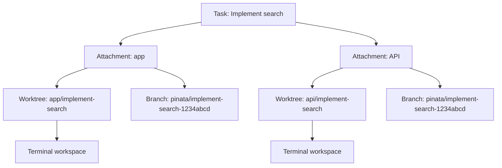
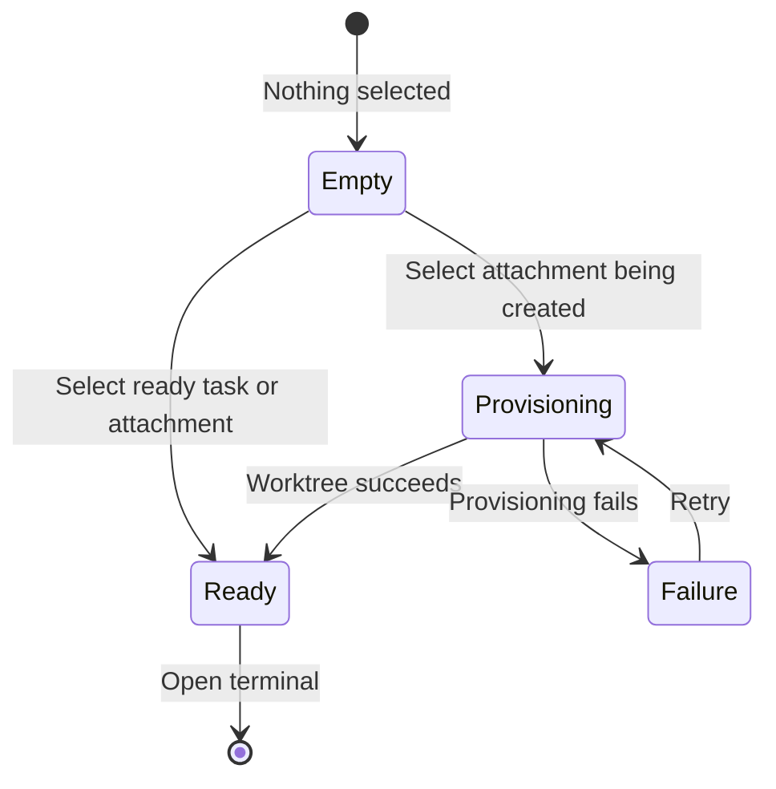
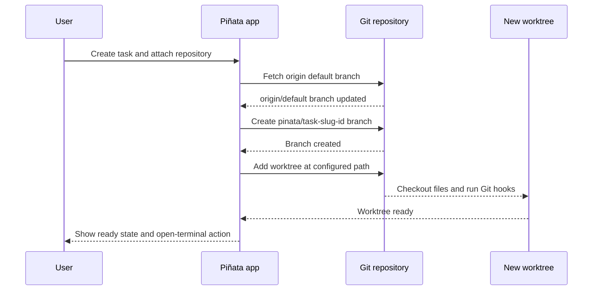
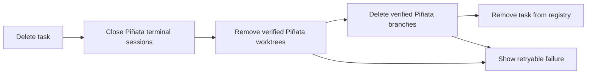

# Product and workflow

## What Piñata is

Piñata is a task-first macOS workspace for coding work. The user starts with a task title, then optionally attaches local or SSH-backed Git repositories. Each attachment gets an isolated worktree and a terminal, so one task can safely involve several repositories.

The task is the product's durable unit. A repository is attached to a task, rather than owning it.

## Core concepts

| Concept | Meaning | Can exist without its parent? |
| --- | --- | --- |
| Task | A piece of work, such as a bug, idea, or feature. | Yes |
| Repository | A registered local or SSH-backed Git repository. | Yes |
| Attachment | A repository assigned to a task. | No, it belongs to one task and repository pair. |
| Worktree | An isolated checkout created for an attachment. | No, it is created from the attachment. |
| Piñata branch | A Piñata-owned branch named `pinata/<task-slug>-<id>`. | No, Piñata creates and removes it with the worktree. |
| Terminal workspace | Tabs and split panes for a selected task or attachment. | Yes, for a task with no repository it uses the task workspace. |
| Terminal pane | One Ghostty surface attached to one durable zmx session. | No, it belongs to a terminal tab. |



## Sidebar and workspace

The sidebar is the task navigator.

- **Pinned** contains manually pinned tasks and is displayed above normal tasks.
- **Tasks** contains the remaining tasks.
- Tasks can be sorted within either section by drag and drop. Moving a task between sections changes its pinned state.
- A task with repositories can expand to show repository attachments.
- Selecting a task shows its task workspace. Selecting an attachment shows its repository workspace.
- The sidebar can be docked, hidden, or shown transiently from the left edge.

The main workspace shows one of three states:



`Ready` shows the first-terminal action until a terminal is opened. A failed attachment shows the failure and a retry action. If a task has both successful and failed attachments, each attachment remains independently selectable.

## Files panel

The independently resizable right panel contains Files, Review, and PR tabs. Files is implemented; Review and PR are placeholders.

- The tree root is the active workspace's initial working directory and never follows terminal `cd` commands.
- A repository attachment shows its repository name at the root, even when its worktree directory uses the task slug.
- Local and SSH folders load incrementally, with bounded background prefetch for the next two levels.
- Opening a folder prioritizes that request over prefetch. Command-clicking collapses the folder and every expanded descendant.
- Local filesystem changes update loaded folders while the panel is visible. SSH workspaces use foreground-only change polling.
- Cached listings and expanded paths survive app restarts and are removed with the owning task or attachment.
- Appearance settings choose colored or monochrome file icons.
- Single-clicking a file opens or reuses an italic preview tab. Double-clicking opens a permanent tab. Preview behavior is enabled by default and can be disabled under Settings → Editor.
- File tabs are fully editable for local and SSH targets. `Cmd+S` writes the current UTF-8 text, and a `*` in the tab title marks unsaved changes.
- The editor uses the Pinata syntax palette, detects common language and configuration formats from the file name, and supports Markdown headings, emphasis, links, fenced code, and inline code.
- File loading shows an activity state. Files larger than 4 MB or files that are not UTF-8 text are rejected with an editor error.

The left task sidebar and right workspace panel have separate controllers, visibility state, constraints, resize handles, and persisted widths. Changes to one side must not alter the other side's spacing or behavior.

## Create a task

1. The user chooses **New task** and gives the work a title.
2. They may select zero or more registered repositories.
3. Piñata saves the task immediately.
4. Each selected repository provisions independently and in parallel.
5. A task with no repositories is still valid. Repositories can be attached later.

Creating a task does not change the source repository's checked-out branch. It only adds a new worktree and Piñata-owned branch.

## Worktree provisioning

Each repository attachment follows this sequence. Attachments run in parallel, while the steps inside one attachment run in order. For an SSH-backed repository, each Git operation runs through its saved OpenSSH alias on the remote host.



### Branch source

Piñata fetches the registered repository's configured default branch first. The new branch is then created from the updated `origin/<default-branch>` reference. This avoids basing new worktrees on a stale local branch.

### Naming

The task title is serialized to lowercase words separated by hyphens. For example, `Fix SSO sign in` becomes `fix-sso-sign-in`.

For a task ID beginning with `1234abcd`:

```text
Branch:    pinata/fix-sso-sign-in-1234abcd
Worktree:  <base>/<repository-name>/fix-sso-sign-in
```

If that destination exists, Piñata uses a numeric suffix such as `fix-sso-sign-in-2`.

### Worktree location

The global default is `~/.pinata/worktrees`. It can be overridden per repository.

| Setting | Example | Result |
| --- | --- | --- |
| Global base | `~/.pinata/worktrees` | `~/.pinata/worktrees/<repository>/<task-slug>` |
| Absolute repository override | `/Volumes/worktrees` | `/Volumes/worktrees/<task-slug>` |
| Repository-relative override | `./worktrees` | `<repository>/worktrees/<task-slug>` |

The global path adds the repository name to avoid collisions. A repository override is treated as the exact root chosen for that repository.

### Progress and failure

Piñata displays the current high-level step, not raw Git command output. Git output may add recognized substeps, such as preparing the worktree, copying files, checking out files, receiving changes, resolving changes, or running hooks.

If a step fails, the attachment retains a concise failure summary. The user can retry it. A retry uses the attachment's saved task and repository context, and does not block other attachments.

## Task editing and cleanup

### Editing

The task menu supports rename, pin or unpin, and attach repositories. Updating a task can change its title and add new attachments. Existing attachments remain attached.

### Detach one repository

Detaching an attachment closes its Piñata terminals, removes its Piñata-owned worktree and branch, then removes the attachment from the task. The original registered repository is never deleted.

### Delete a task

Deleting a task closes its Piñata terminal sessions and cleans up every attached Piñata-owned worktree and branch. Piñata verifies ownership before removal, so it does not remove arbitrary worktrees or branches.



If cleanup fails, the task stays visible in a deleting or failed state. This keeps the result actionable rather than silently losing the user's task reference.

## Settings and appearance

Piñata persists application settings locally: dark or light theme, accent color and intensity, application font size, terminal font size, editor font size, file preview behavior, file-icon color, panel widths, and worktree defaults. Colors and typography are supplied through the shared AppKit theme system so light and dark appearances use the same semantic roles.

## Current product limits

- SSH uses an existing OpenSSH alias and non-interactive key authentication. Piñata does not manage keys, passwords, host verification, tunnels, or port forwarding.
- No diff, review, checks, or pull request workflow. Review and PR tabs are placeholders.
- No Pi discussion UI, Pi daemon, or agent-specific persistence.
- No recovery of a local shell after macOS restarts, or a remote process after its host restarts.

For terminal persistence and its exact limits, see [Terminal session architecture](terminal-session-architecture.md).
