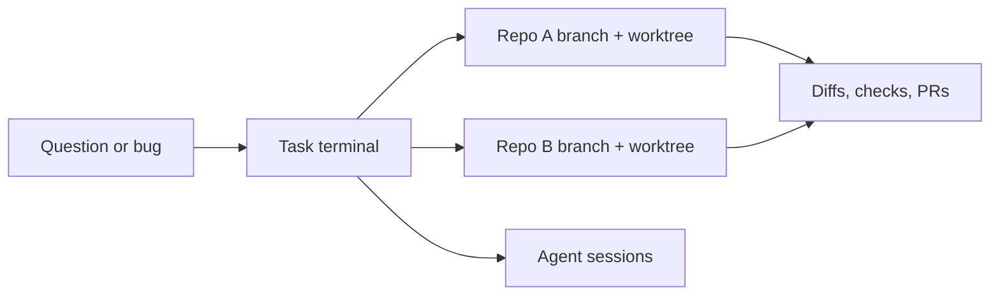
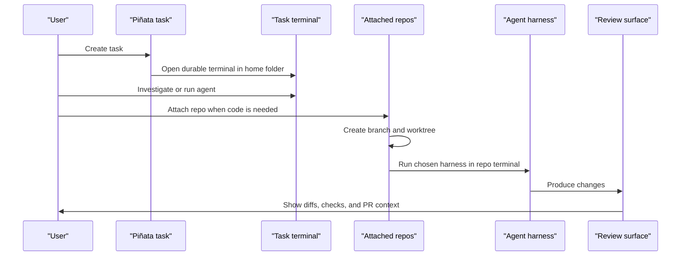

# Piñata Product Vision

Piñata is a terminal-first macOS workspace for coding work that does not fit cleanly inside one
repo, one agent, or one terminal tab.

The product bet is simple: the task is the real unit of work. A task may begin as a thought,
investigation, bug report, or agent prompt. It may later attach one repo, then another, then a review
flow. Piñata keeps that whole shape together without owning the agent or hiding the shell.

## Product Thesis

Modern coding work is no longer just "open repo, edit files, push branch."

It often looks like this:

Piñata makes this workflow explicit:

- Start with a task, not a repo.
- Keep a home terminal for thinking, planning, and agent orchestration.
- Attach repos only when the task needs code changes.
- Give every attached repo an isolated branch, worktree, and terminal.
- Bring files, diffs, checks, and PRs close to the terminal work instead of spreading them across
  tabs and windows.

## Core Capabilities

| Capability | Product intent |
|---|---|
| Task terminal | Every task has a durable shell, even with no repo attached. Useful for research, planning, and agent runs. |
| Multi-repo task | A task can own several repo contexts without becoming several unrelated terminal tabs. |
| Repo attachment | Repos can be added when the task needs them, not before. |
| Branch and worktree ownership | Piñata creates task-owned branches and worktrees so code work stays isolated. |
| Embedded terminal | Users run their own harness: `pi`, `claude`, `codex`, scripts, or plain shell. |
| Durable sessions | Bundled tmux keeps shell sessions alive across webview and app restarts. |
| Native workbench | Tauri keeps filesystem, git, menus, and window behavior native. |
| Future review surface | Files, diffs, checks, and PRs should live near the task, not in scattered browser tabs. |

## Positioning

This is a positioning lens, not a full audit of every external product. The point is to clarify what
Piñata is trying to own.

| Tool shape | Strong at | Where Piñata differs |
|---|---|---|
| Classic terminal, iTerm, Warp | Fast shell access, user-owned config, familiar terminal behavior | Piñata adds task state, repo attachment, worktree lifecycle, and future review context around real terminals. |
| tmux, cmux | Multiplexing terminal sessions | Piñata uses tmux as infrastructure, but the product unit is task plus repos, not panes alone. |
| Superset, Supacode, or repo-bound workbenches | Working from a repository-centered model | Piñata can start repo-less, then attach repos later. This supports investigation and planning before code exists. |
| Conductor-style orchestration | Coordinating structured workflows | Piñata keeps orchestration close to local terminals and git worktrees, with the user choosing the agent or harness. |
| ChatGPT Codex | Agentic coding assistance and cloud or app workflows | Piñata is the local task workbench where Codex can be one terminal participant among others. |
| IDEs | Editing, language tooling, file navigation | Piñata is not trying to replace the editor. It should launch and frame the surrounding task, terminal, repo, and review workflow. |
| Browser tabs and GitHub | Source of truth for PRs and code review | Piñata should surface the relevant review state in context, while GitHub remains the canonical remote. |

## What Piñata Must Not Become

- Not an agent output parser.
- Not a fake terminal.
- Not a repo-only project picker.
- Not an IDE clone.
- Not a task manager detached from real local git state.

The shell stays real. The product value is the structure around it.

## North Star Workflow

## Product Principles

- Terminal-first, never terminal-hostile.
- Task-first, not repo-first.
- Multi-repo by default, without forcing multi-repo complexity.
- Local git state is explicit and reversible.
- High-impact operations need clear confirmation.
- Durable sessions matter more than decorative UI.
- Design should feel native, dense, and quiet until attention is needed.

## Near-Term Capability Map

| Area | Current | Next |
|---|---|---|
| Tasks | Create, edit, delete, select task terminal | Archive and restore tasks |
| Repos | Register, attach, create branch and worktree | Add/remove repos after task creation with richer recovery |
| Terminal | One task terminal and one repo terminal per attached repo | Tabs and splits |
| Settings | Theme, accent, intensity, app font, terminal font, repo registration | More terminal behavior settings |
| Review | Not implemented | Files, diffs, checks, PR context |
| Context passing | Not implemented | Move findings between task and repo terminals |

## Success Bar

Piñata works when a user can say:

> I do not care which repo this starts in. I care about the task. Give me a terminal, let me think,
> then let me attach the repos that become relevant.

That is the gap Piñata owns.
