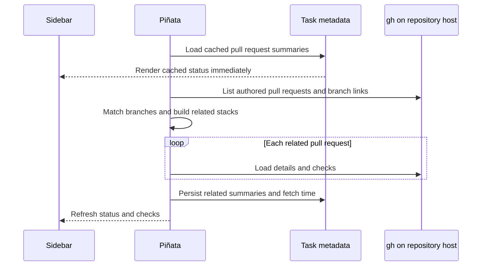
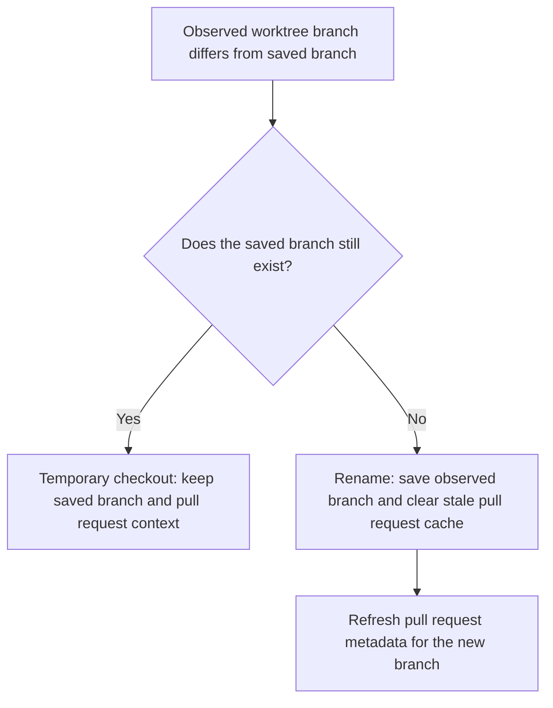

# Pull request status

Piñata shows read-only GitHub pull request status for repository attachments. It uses the `gh` executable already installed in the repository environment. Local repositories use the Mac installation. SSH repositories use the installation on the remote host.

The feature is unavailable when `gh` is missing, is not authenticated, or cannot access the repository. Piñata does not bundle `gh` and does not change the active `gh` account.

## Repository profile

Repository details contain a **GitHub CLI profile** setting. The default uses the active profile reported by `gh auth status --hostname github.com`. A repository can instead select another discovered profile.

The selected profile belongs to the repository and to the machine that hosts it. For an SSH repository, profile discovery and every pull request command run on the SSH host. Piñata obtains that profile's token for the command without changing global `gh` configuration. If a saved profile is no longer available, settings keep it visible as unavailable rather than silently choosing another account.

## Fetch and persistence

Piñata queries only registered repositories attached to current tasks. Attachments that share the same repository checkout, execution target, and `gh` profile share one metadata query.



The metadata query lists pull requests authored by the selected profile. Piñata performs branch reconciliation itself, then asks `gh` for full details and checks only for matching pull requests. This avoids loading check data for unrelated work.

| Query | Scope |
| --- | --- |
| `gh pr list --state all --author @me --limit 2000` | Once per repository checkout, execution target, and profile. It returns branch links and basic state. |
| `gh pr view <number>` | Once for each related pull request. It returns the title, merge and review state, URL, and checks. |

Refresh runs when the workspace loads, when the app becomes active, and every 60 seconds while the app is active. Cached summaries remain visible during a background refresh. If a refresh fails, Piñata keeps the last successful summaries instead of replacing useful data with an empty result.

## Branch and stack matching

The attachment's saved branch is the starting point. Piñata follows pull request links in both directions, so a task can surface a complete stacked series rather than only the pull request whose head exactly matches the branch.

For example, this stack is displayed from the main base toward the stack tip:

```text
feature-a -> main
feature-b -> feature-a
feature-c -> feature-b
```

Closed, unmerged pull requests are omitted. Open and merged pull requests remain visible. Branches with equivalent `stack/` or `pinata/` prefixes can match the saved task branch when their remaining path is the same.

The saved branch changes only for a real rename:



This prevents a temporary `git switch` inside the worktree from moving the task to unrelated pull requests.

## Sidebar presentation

The repository row shows a pull request icon when matches exist. One pull request uses its status color. Multiple pull requests use a neutral icon with a count because one color cannot represent the whole stack.

| Pull request state | Icon color |
| --- | --- |
| Draft | Gray |
| Open and ready | Green |
| Conflict, requested changes, blocked merge, or failed check | Red |
| Merged | Purple |

Hovering the repository row opens its details. Each pull request row shows its number, title, branch link, and a check-status donut. The entire row opens the pull request in the default browser. Hovering a row shows a scrollable check list beside the pull request list.

| Check state | Color |
| --- | --- |
| Passed | Green |
| Failed | Red |
| Pending or unknown | Yellow |
| Skipped or neutral | Gray |

The first fetch shows a centered loading message. Later refreshes keep the existing rows in place and show a small activity indicator beside the section title.

## Limits

Piñata does not create, edit, merge, approve, or close pull requests. It does not rerun checks. The Review and PR tabs in the right workspace panel remain placeholders.
