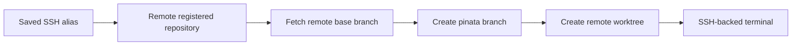

# SSH connections

Piñata can register a Git repository that lives on an SSH host. Connections store only a display name and an existing SSH alias. Credentials, keys, host verification, and configuration remain owned by OpenSSH.

## Setup

1. Add a host alias to `~/.ssh/config` and verify it with `ssh <alias>`.
2. In Settings → Connections, Piñata groups configured aliases into remote hosts and hides Git-only transport entries. Enable the host you want to use.
3. Open the enabled host, choose **Browse remote folders**, then register the Git repository from its root folder.

Piñata uses `ssh -o BatchMode=yes`. Interactive password prompts are deliberately unsupported. Configure an SSH agent or key authentication first.

## Repository lifecycle

Worktrees use the same configured global or repository-specific base path. `~/` remains a remote path and is expanded by the remote shell, never by the Mac.

Removing an attached remote repository removes its verified `pinata/` worktree and branch on that same host. Piñata will not remove an unverified remote path.

## Durable terminals

An SSH terminal is a normal Piñata terminal session whose child process is `ssh -tt <alias>`. The local Piñata terminal service remains alive when the app closes, so reopening Piñata reconnects Ghostty to the same SSH client and remote shell while the Mac and connection remain alive.

If the Mac, local service, or remote host restarts, no terminal process can be recovered exactly. Piñata restores the pane and remote directory, then starts a fresh SSH shell. The saved terminal transcript remains available through Ghostty scrollback.

## Limits

This first version does not install software on remote hosts and does not use tmux. It supports existing SSH aliases, remote Git inspection, worktree provisioning and cleanup, and durable SSH terminal panes. Connection editing, interactive SSH authentication, port forwarding, and remote process recovery are intentionally out of scope.
