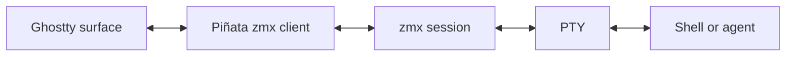

# Terminal Session Architecture

Piñata uses zmx for terminal-process persistence. Ghostty renders the terminal and Piñata owns the tabs, splits, and pane IDs. zmx owns the PTY, child process, terminal state, and scrollback.

## Design

Each pane has a stable UUID. Piñata derives the zmx name as `pinata-<pane-uuid>` and persists the pane UUID with its workspace layout. Restoring a pane attaches to that same zmx session, which rehydrates the terminal content before streaming live output.

For local panes, Piñata runs its bundled zmx binary. For SSH panes, it preflights the registered alias, then runs `ssh -tt <alias> zmx attach <pane-id>` and zmx runs on the remote host. SSH uses non-interactive authentication and a 10-second connect timeout. A failed preflight or attachment leaves the pane open, reports the cause, and retries with bounded exponential backoff. Do not nest local zmx around SSH.

## Lifecycle

| Event | Result |
| --- | --- |
| Create pane | Piñata attaches to, or creates, its named zmx session. |
| Close Piñata | zmx client detaches. The session and shell continue. |
| Reopen Piñata | Ghostty attaches to the same zmx session and restores its display. |
| Connection loss | Piñata retries the attachment to the same zmx session automatically. |
| Close pane or terminal tab | Piñata kills that named zmx session. |
| Local Mac restart | Local processes end. Remote zmx sessions remain available. |
| Remote host restart | Remote processes end and Piñata creates a fresh shell. |

zmx is pinned to `0.7.0`. Updating zmx while sessions are active is unsupported because incompatible daemon sockets can end sessions.
