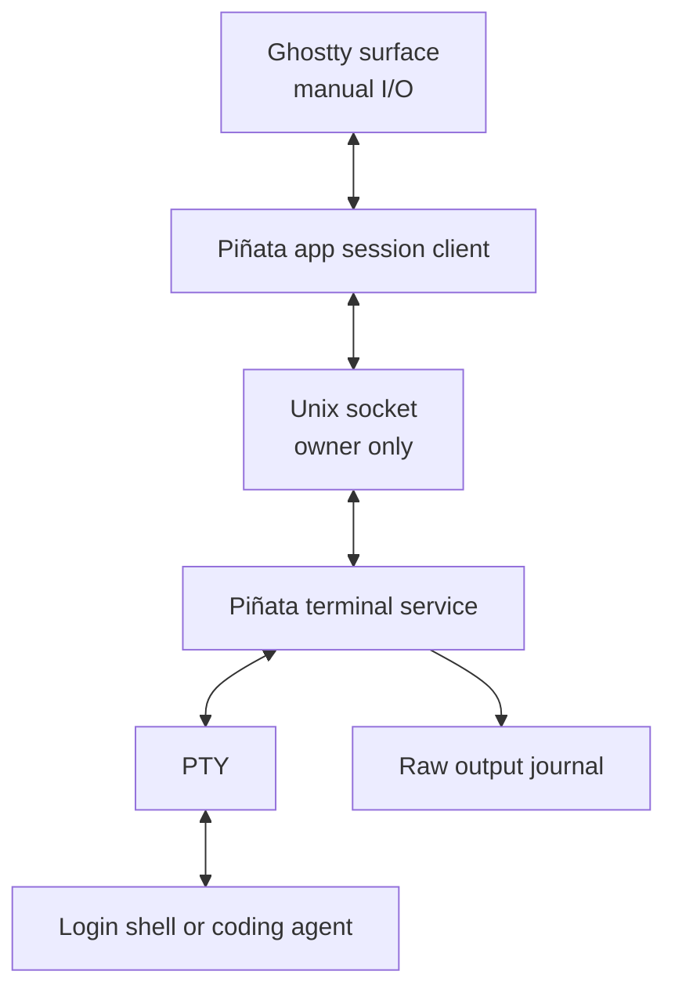

# Terminal Session Architecture

Piñata keeps terminals alive across an app quit without wrapping Ghostty in tmux or changing its native interaction model.

## Goal

Closing and reopening Piñata restores the terminal layout and reconnects to the same local shell processes. A running command, coding agent, shell variables, working directory, and scrollback keep moving while the Piñata window is closed.

## Design



Ghostty remains the terminal emulator and renderer. Piñata uses Ghostty's manual I/O mode, so terminal bytes travel directly between Ghostty and Piñata's service. There is no terminal multiplexer, alternate scrollback, prefix key, or external dependency.

Each terminal pane has a stable UUID. The app session snapshot stores the UUID, working directory, tab order, split tree, and active pane. The matching Piñata terminal service owns the PTY, child process group, Unix socket, and raw output journal.

## Lifecycle

| Event | Result |
| --- | --- |
| Create pane | Piñata starts a service and a login shell for its UUID. |
| Close Piñata | The app saves its snapshot and disconnects. The service and shell continue. |
| Reopen Piñata | The restored Ghostty pane attaches to the existing service and replays its journal. |
| Close pane or terminal tab | Piñata sends `close`, hangs up the process group, and removes the socket and journal. |
| Shell exits | The service starts a fresh login shell in the same pane. |
| Mac or remote host restarts | The live process cannot be recovered. Piñata restores the layout, starts a fresh session, and the shell is considered interrupted. |

Only an explicit pane or terminal-tab close stops a session. Quitting the application is deliberately not a close operation.

## Transport and recovery

The local protocol is newline-delimited Codable messages over a per-session Unix domain socket. Input, resize, output, attach, and close messages use non-blocking descriptors so a fast terminal never blocks the UI. A disconnected service is shown in the terminal instead of pretending that an input was delivered.

The service journals raw terminal output in Application Support using owner-only permissions. A reconnect receives that journal before live output. The journal exists only while the pane session exists and is deleted on explicit close.

This preserves terminal display state, not a serializable process checkpoint. If the operating system kills the helper or the host restarts, Piñata can restore UI state but no terminal application can resume the old process memory.

## Agent sessions

Long-running agents stay alive exactly like any other child process while the host remains up. Their own durable session IDs, transcripts, and checkpoints remain the source of truth for host-restart recovery. Piñata will surface an interrupted session and offer the agent's native resume command when that integration is added.

## SSH terminals

SSH uses the same local protocol and session model:

```text
Ghostty manual I/O ↔ local Piñata terminal service ↔ ssh -tt alias ↔ remote shell
```

The SSH client is the service child process, so a normal app restart reconnects Ghostty to the still-running local client and remote shell. A Mac or remote-host restart starts a fresh remote shell at the saved working directory. See [SSH connections](ssh-connections.md) for setup and limits.

## Boundaries

- No tmux dependency or compatibility path.
- No cloud persistence or terminal-output upload.
- No promise to recover live processes after a host restart.
- No agent-specific persistence implemented yet.

## Validation

Core tests cover protocol round trips, unique safe per-session paths, and app-session layout persistence. Manual acceptance checks:

1. Start a long-running command in a terminal.
2. Quit Piñata normally.
3. Reopen Piñata and confirm the same pane, scrollback, and running command return.
4. Close that terminal tab and confirm the child process is stopped.

For the broader application architecture and persistence map, see [Application architecture](application-architecture.md).
