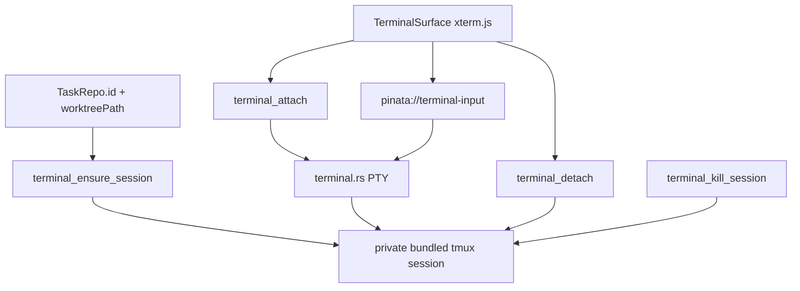

# Terminal

## Current scope

- One embedded terminal per `TaskRepo`.
- The terminal renders in `MainSurface` when the selected task repo has a persisted `worktreePath`.
- `xterm.js` owns rendering, keyboard input, cursor, and resize fitting in the webview.
- Rust owns PTY attachment and byte transport. Output crosses the webview as base64 chunks so
  terminal bytes do not expand into large JSON arrays.
- Keystrokes use the fire-and-forget `pinata://terminal-input` event, not a command roundtrip.
- Bundled `tmux` owns durable shell sessions, so quitting Piñata detaches from the terminal instead
  of killing the shell or running agent.
- Piñata uses the bundled `src-tauri/resources/tmux/bin/tmux-*` runtime in dev and packaged builds.
  It must not depend on a user-installed `tmux`.
- The `tmux` server uses a private Piñata socket under the app data directory, not the user's
  default tmux server.
- Piñata disables the tmux status bar and enables tmux mouse mode. Wheel scrolling must move through
  tmux pane history, not through shell prompt history.
- The terminal keeps tokenized inner padding so shell text does not sit against the panel border.
- Terminal colors must not use app accent tokens. ANSI colors, cursor, selection, and shell output
  stay on terminal/status tokens so accent changes do not repaint terminal content.
- Session identity is deterministic from `TaskRepo.id`.
- The shell starts in `TaskRepo.worktreePath`.
- The default shell is the user's `SHELL`; `zsh`, `bash`, and `fish` run as login shells. Missing
  or invalid `SHELL` falls back to `/bin/zsh`.

## Lifecycle

## Task integration

- Task creation creates each repo worktree, then ensures the matching terminal session exists.
- Task edit ensures terminal sessions for newly added repos.
- Task edit and task delete kill the task repo terminal session before deleting that task-owned
  worktree and branch.
- Rollback also kills any terminal sessions created during a failed transaction.

## App state

- Do not add a terminal mapping for v1.
- `TaskRepo.id` is enough to rederive the `tmux` session name.
- `TaskRepo.worktreePath` is enough to reopen the shell in the correct folder if the session does
  not already exist.
- Future tabs and splits may add durable layout state, but live process details remain outside
  app-state JSON.

## Deferred

- Multiple terminal tabs per repository.
- Split panes.
- Terminal title/status bar.
- Explicit kill/restart terminal action.
- Restoring xterm scrollback from `tmux capture-pane` on attach.
