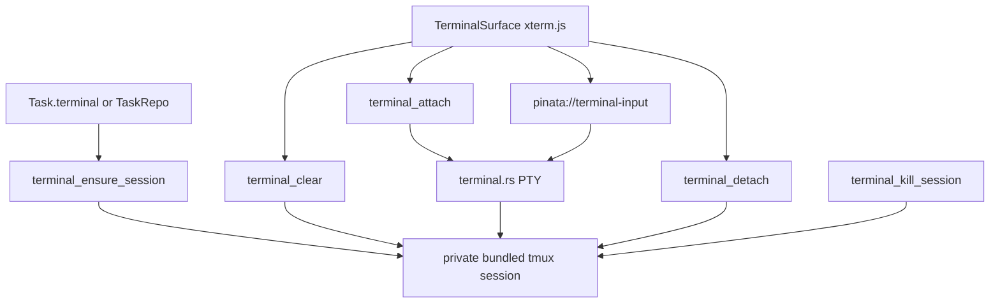

# Terminal

## Current scope

- One embedded task terminal per `Task`.
- One embedded repo terminal per attached `TaskRepo`.
- A terminal surface is one selectable terminal context inside a task: the task terminal or one
  attached repo terminal.
- `MainSurface` renders the selected task surface as a tab set. Each surface owns its own tabs, and
  each tab owns its own pane tree.
- Missing tabs for an open surface render as one shell tab with one pane.
- `⌘T` creates a new shell tab in the selected surface. If that surface was closed, it reopens it
  with one shell tab.
- Terminal tabs use the shell icon, show the editable tab title, and show a small naked count pill
  when the tab contains more than one pane.
- Pane headers show the shell name while idle. When the pane is running a foreground command, the
  pane header temporarily shows that command label.
- Double-clicking a tab title edits it inline. Enter or blur saves the persisted tab title. Escape
  cancels.
- `⌘D` splits the active terminal vertically into side-by-side panes. `⌘⇧D` splits it
  horizontally into stacked panes. The new pane starts in the same cwd as the active pane and owns
  a separate tmux session.
- A pane stores both a tmux `sessionId` and a source, either task terminal or one task repo. Split
  panes inherit the active pane source. Sidebar clicks switch to that source's own tab set.
- Clicking a pane makes it active and updates the task sidebar selection to that pane source.
- `⌘W` closes the active pane. If tmux reports a foreground command that is not the user's shell,
  Piñata shows a warning before killing that pane's session.
- Closing the final pane in a tab closes that tab.
- Closing a tab kills every pane session in that tab. If any pane is running a foreground process,
  Piñata shows a warning before killing those sessions.
- Closing the final tab for one surface stores `Task.terminalClosedBySurface` and shows an empty
  main surface. If Settings `closeAppOnLastPane` is enabled, closing that final tab closes Piñata
  after the sessions are stopped.
- `xterm.js` owns rendering, keyboard input, cursor, and resize fitting in the webview.
- Rust owns PTY attachment and byte transport. Output crosses the webview as base64 chunks so
  terminal bytes do not expand into large JSON arrays.
- Keystrokes use the fire-and-forget `pinata://terminal-input` event, not a command roundtrip.
- Bundled `tmux` owns durable shell sessions, so quitting Piñata detaches from the terminal instead
  of killing the shell or running agent.
- Piñata uses the bundled `src-tauri/resources/tmux/bin/tmux-*` runtime in dev and packaged builds.
  It must not depend on a user-installed `tmux`.
- The `tmux` server uses a private Piñata socket under the app data directory, not the user's
  default tmux server.
- Piñata disables the tmux status bar and leaves tmux mouse mode off. xterm owns normal text
  selection, while tmux owns durable pane history.
- The terminal keeps tokenized inner padding so shell text does not sit against the panel border.
- The xterm scrollbar is hidden. Wheel and trackpad gestures are stopped before they can reach the
  shell and are mapped to tmux pane history. The next user input exits tmux scrollback before sending
  bytes to the shell, so typing snaps back to the live cursor.
- `⌘K` clears the visible xterm buffer and asks tmux to clear pane history for the selected session.
- `terminal_process_status` asks tmux for the pane command and tty, then prefers the top non-shell
  process from the tty foreground process group so helper children do not replace the command the
  user launched. Username-shaped vendor wrapper labels are ignored for the same reason.
- `⌘C` copies the active xterm selection. `⌘V` stays on xterm/webview's native paste path so paste
  input is not duplicated.
- Right-click never falls through to tmux or the browser context menu. If text is selected, it
  copies the selection; otherwise it does nothing.
- If a terminal program later enables mouse reporting, Option-click still forces xterm selection on
  macOS.
- Terminal colors must not use app accent tokens. ANSI colors, cursor, selection, and shell output
  stay on `--color-terminal-*` tokens so accent changes do not repaint terminal content.
- Terminal font size comes from Settings `terminalFontSize`; changing it updates xterm options,
  refits the renderer, and sends the new PTY size to Rust.
- Session identity is deterministic from the selected surface id for the first pane:
  `Task.terminal.id` for task terminals, `TaskRepo.id` for repo terminals. Split-created panes use
  persisted `terminal-pane-*` session ids.
- Terminal command and event payloads call that value `sessionId`. Do not name it `taskRepoId`,
  because task terminals use the same transport.
- The shell starts in `Task.terminal.cwd` for task terminals and `TaskRepo.worktreePath` for repo
  terminals.
- The default shell is the user's `SHELL`; `zsh`, `bash`, and `fish` run as login shells. Missing
  or invalid `SHELL` falls back to `/bin/zsh`.

## Lifecycle

## Task integration

- Task creation always creates a durable task terminal target. It creates repo worktrees only for
  attached repos.
- Task edit ensures terminal sessions for newly added repos.
- Task edit and task delete kill repo terminal sessions before deleting task-owned worktrees and
  branches.
- Task delete also kills the task terminal session.
- Rollback also kills any terminal sessions created during a failed transaction.

## App state

- `Task.terminalTabs` persists tab sets per task surface. Keys are `task-terminal` or
  `repo:<TaskRepo.id>`.
- Each `TaskTerminalTab` persists its pane topology, active pane id, pane session targets, and pane
  source for that surface only.
- Missing tabs for the selected open surface means that surface renders as one shell tab with one
  pane.
- `Task.terminalLayout` and `Task.terminalLayouts` are legacy migration fields only. New writes use
  `Task.terminalTabs`.
- `Task.terminalClosedBySurface` suppresses that implicit single tab after the user closes the
  final tab for one surface. `⌘T` or splitting reopens that surface.
- Live process handles, terminal scrollback, and PTY readers remain outside app-state JSON.
- Task edits that add or remove repos reset the task tab layouts so stale panes do not keep
  pointing at removed worktrees.

## Deferred

- Resizing split dividers.
- Explicit kill/restart terminal action.
- Restoring xterm scrollback from `tmux capture-pane` on attach.
