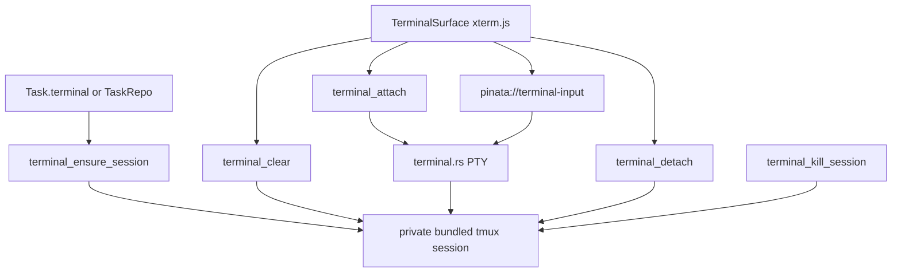

# Terminal

## Current scope

- One embedded task terminal per `Task`.
- One embedded repo terminal per attached `TaskRepo`.
- The terminal renders in `MainSurface` for the selected task surface. Task terminals start in `~`.
  Repo terminals render once the selected repo has a persisted `worktreePath`.
- `xterm.js` owns rendering, keyboard input, cursor, and resize fitting in the webview.
- Rust owns PTY attachment and byte transport. Output crosses the webview as base64 chunks so
  terminal bytes do not expand into large JSON arrays.
- Keystrokes use the fire-and-forget `pinata://terminal-input` event, not a command roundtrip.
- Bundled `tmux` owns durable shell sessions, so quitting Piñata detaches from the terminal instead
  of killing the shell or running agent.
- Piñata uses the bundled `src-tauri/resources/tmux/bin/tmux-*` runtime in dev and packaged builds.
  It must not depend on a user-installed `tmux`.
- The `tmux` server uses a private Piñata socket under the app data directory, not the user's
  default tmux server.
- Piñata disables the tmux status bar and leaves tmux mouse mode off. xterm owns normal text
  selection, while tmux owns durable pane history.
- The terminal keeps tokenized inner padding so shell text does not sit against the panel border.
- The xterm scrollbar is hidden. Wheel and trackpad gestures are stopped before they can reach the
  shell and are mapped to tmux pane history. The next user input exits tmux scrollback before sending
  bytes to the shell, so typing snaps back to the live cursor.
- `⌘K` clears the visible xterm buffer and asks tmux to clear pane history for the selected session.
- `⌘C` copies the active xterm selection. `⌘V` stays on xterm/webview's native paste path so paste
  input is not duplicated.
- Right-click never falls through to tmux or the browser context menu. If text is selected, it
  copies the selection; otherwise it does nothing.
- If a terminal program later enables mouse reporting, Option-click still forces xterm selection on
  macOS.
- Terminal colors must not use app accent tokens. ANSI colors, cursor, selection, and shell output
  stay on `--color-terminal-*` tokens so accent changes do not repaint terminal content.
- Terminal font size comes from Settings `terminalFontSize`; changing it updates xterm options,
  refits the renderer, and sends the new PTY size to Rust.
- Session identity is deterministic from the selected surface id: `Task.terminal.id` for task
  terminals, `TaskRepo.id` for repo terminals.
- Terminal command and event payloads call that value `sessionId`. Do not name it `taskRepoId`,
  because task terminals use the same transport.
- The shell starts in `Task.terminal.cwd` for task terminals and `TaskRepo.worktreePath` for repo
  terminals.
- The default shell is the user's `SHELL`; `zsh`, `bash`, and `fish` run as login shells. Missing
  or invalid `SHELL` falls back to `/bin/zsh`.

## Lifecycle

## Task integration

- Task creation always creates a durable task terminal target. It creates repo worktrees only for
  attached repos.
- Task edit ensures terminal sessions for newly added repos.
- Task edit and task delete kill repo terminal sessions before deleting task-owned worktrees and
  branches.
- Task delete also kills the task terminal session.
- Rollback also kills any terminal sessions created during a failed transaction.

## App state

- Do not add a terminal mapping for v1.
- `Task.terminal.id` and `TaskRepo.id` are enough to rederive `tmux` session names.
- `Task.terminal.cwd` and `TaskRepo.worktreePath` are enough to reopen shells in the correct folder
  if a session does not already exist.
- Future tabs and splits may add durable layout state, but live process details remain outside
  app-state JSON.

## Deferred

- Multiple terminal tabs per repository.
- Split panes.
- Terminal title/status bar.
- Explicit kill/restart terminal action.
- Restoring xterm scrollback from `tmux capture-pane` on attach.
